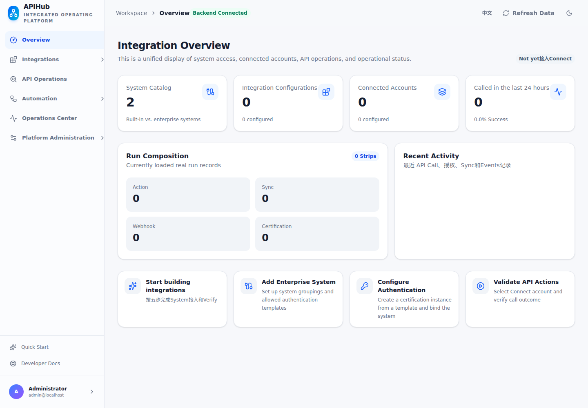
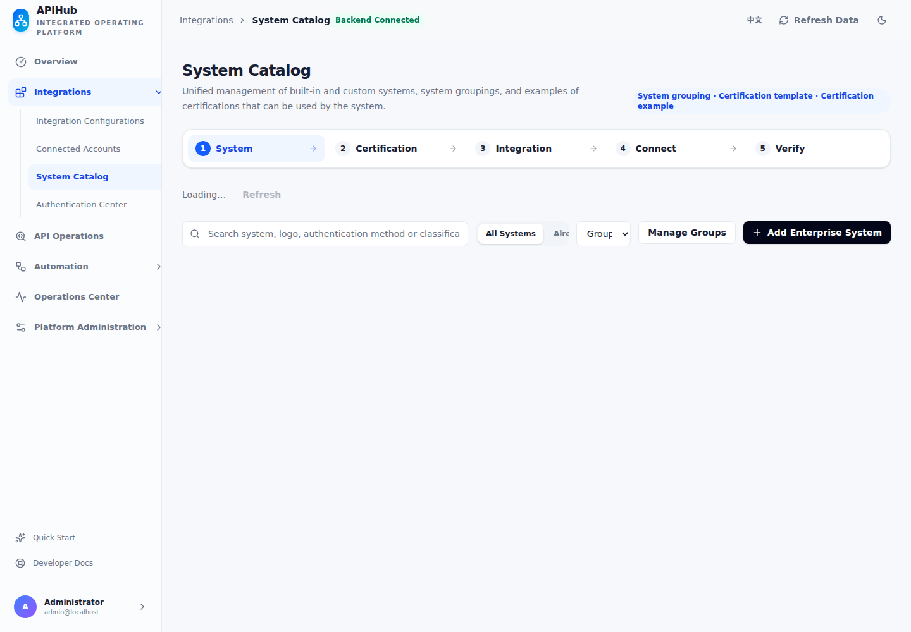
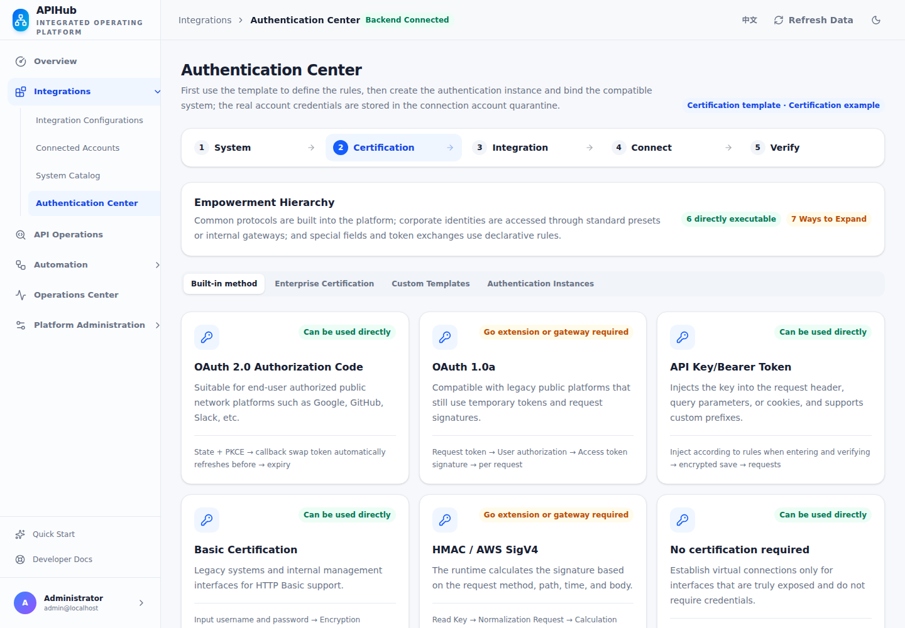
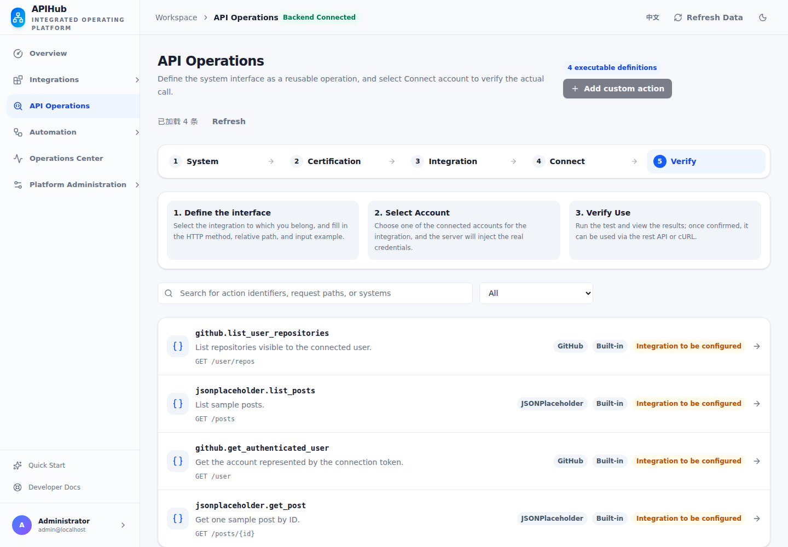
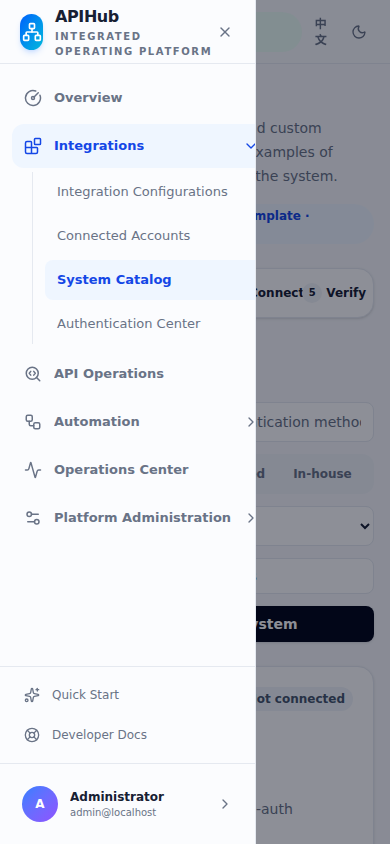
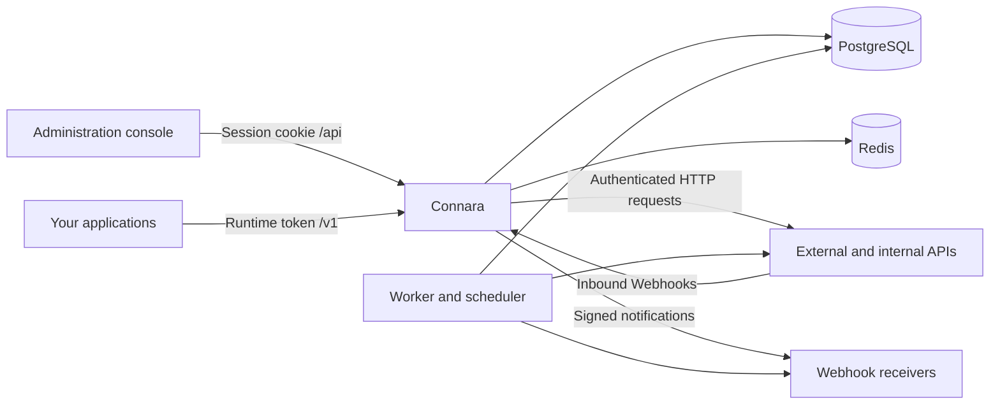

# Connara

**English** | [简体中文](README.zh-CN.md)

**Connect APIs. Own your integrations.**

A self-hosted API integration platform for connecting external services and internal business systems. Manage authentication, account connections, reusable API actions, scheduled synchronization, Webhooks, and execution history from one administration console.

Connara combines a system/action catalog with connection and authentication management. The backend is written in Go, and the React console is embedded in the application binary: a basic installation runs **one Connara process, PostgreSQL, and Redis**.



[](LICENSE)

## Contents

- [Features](#features)
- [Console navigation](#console-navigation)
- [Screenshots](#screenshots)
- [Architecture](#architecture)
- [Quick start](#quick-start)
- [Your first API integration](#your-first-api-integration)
- [Configuration](#configuration)
- [Run as a Linux service](#run-as-a-linux-service)
- [Operations and upgrades](#operations-and-upgrades)
- [Development and testing](#development-and-testing)
- [Project layout and further reading](#project-layout-and-further-reading)
- [Current boundaries](#current-boundaries)
- [Contributing](#contributing)
- [License](#license)

## Features

| Area | What you can do |
| --- | --- |
| System catalog | Browse built-in systems, add internal systems, manage categories, and associate supported authentication templates. Search and filters run on the server. |
| Authentication | Configure reusable authentication templates and system-specific instances, credential fields, token requests, and header/query/cookie injection rules. |
| Integration configuration | Bind a system, authentication instance, and API base URL. The setup flow carries context between pages and preserves non-sensitive drafts. |
| Connected accounts | Save credentials for users, tenants, or service accounts; update credentials; verify access; and distinguish configuration checks from successful upstream verification. Credentials are encrypted with AES-256-GCM. |
| API actions | Define HTTP methods and relative paths, input/output schemas, and required scopes. Validate input, explicitly select an integration and connection, execute a test, inspect results, and copy a matching cURL command. |
| Synchronization | Configure manual or scheduled tasks, record extraction, stable record IDs, pagination, and checkpoints. Deploy, pause, resume, inspect stored records, and open the associated run. |
| Webhooks | Manage inbound event sources and outbound notification endpoints. Verify/sign events, deduplicate incoming events, retry deliveries, and inspect delivery attempts. |
| Operations | View calls, sync runs, authentication events, and Webhooks. Filter by integration, connection, status, and time; open run details directly by URL. Unknown upstream outcomes are shown separately. |
| Access and audit | Issue runtime tokens with explicit action and connection scopes, revoke tokens, search audit history, and export the records currently loaded in the console. |
| Team management | Invite members with expiring, single-use links; accept invitations and set passwords; manage owner, admin, developer, and viewer roles. |
| Administration UI | English/Chinese language switching, light/dark themes, responsive layouts, keyboard-accessible navigation, persistent error feedback, and protection for unsaved forms. |

### Authentication support

Six authentication options can currently be executed directly:

- No authentication.
- API key / Bearer token with configurable injection.
- HTTP Basic.
- Username/password exchange for a token.
- OAuth 2.0 client credentials.
- OAuth 2.0 authorization code with PKCE and token refresh.

The catalog also includes extension templates for OAuth 1.0a, HMAC/AWS SigV4, mTLS, OIDC, JWT service accounts, SAML/token exchange, and Kerberos/NTLM gateways. These require additional implementation or a gateway; a template appearing in the console does not mean its protocol is implemented. Webhook HMAC signing is implemented independently of the HMAC API authentication template.

## Console navigation

The sidebar has six main entries. Related pages appear in collapsible groups, with the active page's group opened automatically.

| Main entry | Pages |
| --- | --- |
| Overview | Integration totals, recent activity, and setup shortcuts |
| Integrations | Integration Configurations, Connected Accounts, System Catalog, Authentication Center |
| API Operations | Action definitions, execution tests, and runtime request examples |
| Automation | Sync Tasks and Webhook |
| Operations Center | Run history, details, and metrics |
| Platform Administration | Access Control, Audit Logs, Team Management, and Platform Settings |

**Quick Start** and **Developer Docs** remain accessible at the bottom of the sidebar. Navigation is shipped with the frontend; there is no separate menu SQL to import.

## Screenshots

Captured from the running console on **2026-09-17**, before the project was renamed from APIHub to Connara. The screenshots retain the original APIHub header. Desktop views use the English UI at 1440 × 1000; mobile navigation is captured at 390 × 844. These are real application screenshots with built-in catalog data; integrations and run history remain empty until configured. Some current English UI copy still contains untranslated Chinese fragments. The [Chinese README](README.zh-CN.md#后台截图) contains the corresponding Chinese screenshots.

### System catalog



### Authentication center



### API actions



<details>
<summary>Mobile navigation</summary>



</details>

## Architecture



- **PostgreSQL is the durable data store:** configuration, encrypted credentials, sessions, runtime tokens, run history, sync records/checkpoints, jobs, outbox events, and audit history.
- **Redis holds transient coordination data:** OAuth state/PKCE, rate-limit windows, and distributed token-refresh locks.
- **The console is embedded with `go:embed`.** A production installation does not need a separate Node.js server or Vite process.
- **`APIHUB_ROLE=all` runs HTTP, worker, and scheduler together.** Additional roles allow separating background processing when needed.

The stack uses Go/Chi, pgx/PostgreSQL, go-redis, React, TypeScript, Vite, Tailwind CSS, and TanStack Query. This is a new Go implementation, not a drop-in replacement for OpenConnector or Nango.

## Quick start

```bash
git clone https://github.com/emaisi/connara.git
cd connara
```

The following is a source-based installation on a Linux host or WSL. Run project commands from the **repository root (`connara`)**. PostgreSQL and Redis can be local or already provisioned elsewhere.

### 1. Prepare prerequisites

| Dependency | Requirement |
| --- | --- |
| Go | `1.27.1` or a compatible newer toolchain, as declared in [go.mod](go.mod) |
| Node.js and npm | Node `20.19+` on the 20.x line, or `22.12+`; required to build the console |
| PostgreSQL | PostgreSQL `15+`, an existing empty database, and a user able to initialize its schema |
| Redis | A reachable Redis instance; Redis `6.2+` is needed for the `GETDEL` command used by OAuth state |
| Shell utilities | Bash, OpenSSL, PostgreSQL client (`psql`); cURL for the health check |

For a locally installed PostgreSQL server, an example database setup is:

```bash
sudo -u postgres createuser --pwprompt apihub
sudo -u postgres createdb --owner=apihub apihub
```

Skip these commands if your database and user already exist. Have Redis listening on `127.0.0.1:6379`, or use your own Redis address in the configuration below.

### 2. Build the application

```bash
npm --prefix web ci
./scripts/build.sh
```

The build creates the embedded console assets and four binaries under `bin/`: `apihub`, `apihub-init`, `apihub-password`, and `apihub-rotate-keys`.

### 3. Generate local configuration

The helper defaults to PostgreSQL at `127.0.0.1:5432`, with database and user both named `apihub`. Supply your intended database settings explicitly:

```bash
APIHUB_DATABASE_HOST=127.0.0.1 \
APIHUB_DATABASE_PORT=5432 \
APIHUB_DATABASE_NAME=apihub \
APIHUB_DATABASE_USER=apihub \
./scripts/configure.sh
```

The script prompts for the PostgreSQL password without echoing it, checks the connection, and generates:

- `.env`: database/Redis configuration, a bcrypt administrator password hash, and a random credential-encryption key.
- `.admin-password`: the generated administrator login password.

Both files use `600` permissions and are ignored by Git. The helper refuses to overwrite an existing `.env`. For non-interactive setup, `APIHUB_DATABASE_PASSWORD_FILE` can point to a protected file containing the database password.

Before initializing, review `.env` and set your Redis address/password and `APIHUB_PUBLIC_BASE_URL`. The helper generates a local HTTP URL and a PostgreSQL URL with `sslmode=disable`; use your database's required TLS mode for a remote deployment. For public HTTPS access, set the public base URL to your real origin before initialization. Preserve the generated encryption key and Bash escaping in this file.

### 4. Initialize and start

```bash
./scripts/init.sh
./scripts/start.sh
```

`init.sh` applies both the base SQL schema and the v2 migration, then inserts first-run data. `start.sh` runs the built binary in the foreground, checks the schema version, and does not reseed or overwrite your configuration. Keep that terminal open for a quick trial; use the [Linux service](#run-as-a-linux-service) instructions for persistent operation.

In another terminal:

```bash
curl --fail --silent --show-error http://127.0.0.1:8080/health/ready
```

Expected result: `{"ok":true}`. Open **<http://127.0.0.1:8080/>**, sign in as **`admin@localhost`**, and read the initial password from `.admin-password` on the server. If you changed `APIHUB_ADMIN_EMAIL` before initialization, use that email instead.

### What a fresh installation contains

With the default bundled catalog, initialization creates:

| Item | Initial data |
| --- | --- |
| Database | Schema version 2 |
| Workspace and owner | One default workspace and one administrator with the owner role |
| Platform settings | Public base URL, default runtime parameters, and retention settings |
| Authentication templates | 13 templates, including the extension templates described above |
| Systems and actions | GitHub and JSONPlaceholder, with four executable HTTP action definitions |
| Business configuration | No authentication instances, integrations, account credentials, sync tasks, or Webhook endpoints |

An action definition still needs an appropriate integration and connection before execution. **Importing only `docs/postgresql-schema-v1.sql` is insufficient:** the v2 migration and Go bootstrap are also required. Use `init.sh` for both new installations and upgrades. Re-running it does not recreate the initial owner or overwrite settings in an already initialized workspace.

## Your first API integration

JSONPlaceholder is included as a public, no-auth example. A real call requires outbound access to that service.

1. Open **Integrations → System Catalog** and select **JSONPlaceholder**.
2. In **Authentication Center**, create a ready authentication instance using **No authentication**, bound to that system.
3. Create an **Integration Configuration** with this instance and the API base URL `https://jsonplaceholder.typicode.com`.
4. Create a **Connected Account** for the integration. Supply an end-user identifier; this no-auth connection does not need an API secret. Copy its connection key from the console.
5. Open **API Operations → `jsonplaceholder.get_post`**, select the integration and connection, and test with `{"id":1}`. Inspect the result and follow its run link to Operations Center.

Saving a connection does not by itself prove the upstream API works. A configured verification path can perform a read-only upstream probe; a successful Action for the selected integration and connection completes the last Quick Start step.

To call the same action from your application, an owner/admin creates a runtime token under **Platform Administration → Access Control**, explicitly granting the action and connection. Use the console's generated request, or adapt:

```bash
read -r -s -p 'Runtime token: ' APIHUB_RUNTIME_TOKEN
printf '\n'
curl --fail-with-body --request POST \
  'http://127.0.0.1:8080/v1/actions/jsonplaceholder.get_post' \
  --header "Authorization: Bearer ${APIHUB_RUNTIME_TOKEN}" \
  --header 'Content-Type: application/json' \
  --data '{"integrationId":"REPLACE_WITH_INTEGRATION_ID","connectionKey":"REPLACE_WITH_CONNECTION_KEY","input":{"id":1}}'
unset APIHUB_RUNTIME_TOKEN
```

Replace both identifiers with values from your console. Runtime tokens and administrator login sessions are separate credentials. Runtime callers can supply `Idempotency-Key`; reuse it only for retries of the same request.

## Configuration

The public project name is **Connara**. The initial release retains the `apihub` binary names, `APIHUB_*` environment variables, Go module name, and existing database schema for compatibility with earlier local installations.

[`.env.example`](.env.example) lists the supported configuration. The launch scripts source `.env` as Bash; its generated quoting should not be treated as a generic systemd `EnvironmentFile`.

| Variable | Purpose |
| --- | --- |
| `APIHUB_ADDRESS` | HTTP listen address; default `:8080`. Use `127.0.0.1:8080` behind a local reverse proxy. |
| `APIHUB_DATABASE_URL` | PostgreSQL connection URL for the runtime process. |
| `APIHUB_MIGRATION_DATABASE_URL` | Optional separate DDL connection used only by `apihub-init`; otherwise initialization uses the runtime URL. |
| `APIHUB_REDIS_ADDR`, `APIHUB_REDIS_PASSWORD`, `APIHUB_REDIS_DB` | Redis address, optional password, and database number. |
| `APIHUB_PUBLIC_BASE_URL` | Externally reachable origin used for integration callbacks; also seeds platform settings on first initialization. |
| `APIHUB_ENCRYPTION_KEY` | Base64-encoded, 32-byte credential-encryption key. Required to decrypt saved credentials. |
| `APIHUB_ENCRYPTION_KEY_VERSION`, `APIHUB_PREVIOUS_ENCRYPTION_KEYS` | Active key version and retained older keys during credential-key rotation. |
| `APIHUB_ADMIN_EMAIL`, `APIHUB_ADMIN_PASSWORD_HASH` | First-run administrator identity and bcrypt hash. Editing them after bootstrap does not reset an existing account. |
| `APIHUB_WORKSPACE_ID`, `APIHUB_WORKSPACE_SLUG`, `APIHUB_WORKSPACE_NAME` | Workspace identity and initial display settings. |
| `APIHUB_ROLE` | `all` (default), `api`, `worker`, or `scheduler`. |
| `APIHUB_ALLOWED_PRIVATE_CIDRS` | Explicit private networks that upstream HTTP requests may reach, separated by commas. |
| `APIHUB_CATALOG_DIR` | Optional JSON provider catalog directory; set before first initialization to seed additional catalog entries. |
| `APIHUB_ENV_FILE` | Alternate configuration file path read by the shell scripts. |

Configuration is partly persisted in PostgreSQL. If changing the public origin after initialization, update both the environment setting and **Platform Settings** so that generated URLs stay consistent. Existing workspaces are not re-imported from the catalog merely by restarting or re-running initialization.

### Roles and access

| Role | Allowed work |
| --- | --- |
| Owner | Manage the platform and ownership; at least one owner must remain. |
| Admin | Manage integrations, runtime tokens, the team, and platform settings; ownership changes remain restricted to owners. |
| Developer | Manage systems, authentication, integrations, connections, actions, sync tasks, and Webhooks. Cannot manage runtime tokens, the team, or platform settings. |
| Viewer | Browse data without saving configuration or running operations. |

Invitations expire after seven days and are accepted through a link where the invited member sets a password. The console generates a link for you to share; it does not send invitation emails.

## Run as a Linux service

After verifying the foreground startup, stop that process with `Ctrl+C`. The example below assumes the application directory has been placed at **`/opt/apihub`**, contains the built `bin/` directory, launch scripts and `.env`, and is owned by a Linux service account named **`apihub`**. Keep `.env` readable only by that account. Build on the same OS/architecture as the deployment target.

Save the following as `/etc/systemd/system/apihub.service`:

```ini
[Unit]
Description=Connara integration platform
Wants=network-online.target
After=network-online.target

[Service]
Type=simple
User=apihub
Group=apihub
WorkingDirectory=/opt/apihub
ExecStart=/opt/apihub/scripts/start.sh
Restart=on-failure
RestartSec=5
TimeoutStopSec=75
UMask=0077

[Install]
WantedBy=multi-user.target
```

Then enable the service:

```bash
sudo systemctl daemon-reload
sudo systemctl enable --now apihub
sudo systemctl status apihub --no-pager
sudo journalctl -u apihub -n 100 --no-pager
```

For a public site, terminate HTTPS at your reverse proxy, forward requests to Connara, preserve the public host and `X-Forwarded-Proto`, and keep `APIHUB_PUBLIC_BASE_URL` consistent with that origin. Use your own database and Redis access controls. Keep a recoverable backup of PostgreSQL **and the encryption keys**; a database backup alone cannot decrypt connection credentials.

## Operations and upgrades

### Health and troubleshooting

| Check / symptom | Meaning or next action |
| --- | --- |
| `GET /health/live` returns 200 | The HTTP process is alive. |
| `GET /health/ready` returns `{"ok":true}` | PostgreSQL and Redis checks passed. `/health` is an alias of readiness. |
| `schema version ... unsupported` | Run the new version's `scripts/init.sh` with migration privileges before starting it. |
| Readiness reports `component: redis` | Check Redis address/password and connectivity. The UI may be reachable while OAuth state, locks, and rate-limited requests remain unavailable. |
| Port 5173 returns API errors | Vite is a development server; start the Go backend on 8080 as well. |
| Internal API address is rejected | Add only the required network or host CIDR to `APIHUB_ALLOWED_PRIVATE_CIDRS`, such as `10.20.0.0/16`. |
| A connection says configured but not verified | Supply an upstream verification path or execute an Action; saved configuration alone is not an upstream success. |
| The console shows old assets | Rebuild the frontend **and** Go binary, then restart. The binary embeds its frontend. |
| A run has an unknown outcome | The upstream operation may have happened. Check the provider before retrying a request with side effects. |

### Updating an installation

Back up the database and retain the existing `.env`, password file, and encryption keys. In a maintenance window, stop the old service, then run from the updated source directory as the application owner:

```bash
npm --prefix web ci
./scripts/build.sh
./scripts/init.sh
```

Restart the service and check `/health/ready`. Do not rerun `configure.sh` against an existing `.env`, and do not generate a new encryption key as part of a routine upgrade. For a separated runtime/DDL setup, give the runtime account access to business tables and read access to `schema_migrations`, and keep migration credentials separate.

### Background processing and delivery

`all` is the simplest single-host mode. `api` excludes background loops; `worker` processes jobs; `scheduler` schedules work and performs housekeeping. Every role still starts an HTTP listener, so give separate processes distinct addresses/ports and the same intended workspace, database, Redis, and encryption configuration.

Webhook notifications use a signed event envelope and at-least-once delivery. Receivers should verify the original request body and deduplicate by event ID. See the [upgrade and Webhook protocol notes](docs/hardening-upgrade.md) for signing headers, retry behavior, pagination settings, and credential-key rotation.

## Development and testing

Start the Go backend with the initialized configuration. In another terminal:

```bash
cd web
npm run dev
```

Open <http://127.0.0.1:5173/>. Vite proxies `/api`, `/health`, and `/v1` to the backend at `127.0.0.1:8080`. Use the configured public backend origin when testing OAuth callbacks or incoming Webhooks.

Run the project checks from the repository root:

```bash
# Go vet, Go race tests, frontend formatting/lint/tests, and production build
./scripts/check.sh

# Temporary PostgreSQL + Redis integration tests; does not load the project's .env
./scripts/test-integration.sh
```

The integration script requires `initdb`, `pg_ctl`, `pg_config`, `redis-server`, and Python 3. If PostgreSQL binaries are outside the default location, set `APIHUB_TEST_PG_BIN` to the directory containing `initdb` and `pg_ctl`. Database-dependent Go tests need this integration environment; a plain `go test` run may skip them.

## Project layout and further reading

```text
cmd/                         Server, initializer, password and key-rotation utilities
internal/authn/              Authentication and token lifecycle
internal/background/         Worker, scheduler, and synchronization
internal/catalog/            Bundled and optional provider definitions
internal/executor/           HTTP action execution and request guards
internal/httpapi/            Administration, runtime, OAuth, and Webhook endpoints
internal/store/              PostgreSQL queries, base schema, and migrations
internal/webui/static/       Generated console assets embedded in the Go binary
web/                         React administration console
scripts/                     Configuration, build, initialization, startup, and checks
docs/                        Design notes, upgrade notes, and console screenshots
```

- [Database and Redis design](docs/postgresql-redis-backend-design.md) — Chinese.
- [Base SQL schema](internal/store/schema.sql) and [v2 migration](internal/store/migrations/002_hardening.sql).
- [Upgrade procedures and Webhook protocol](docs/hardening-upgrade.md) — Chinese; historical rollout notes refer to their recorded date.
- [Screenshot provenance](docs/screenshots/README.md).

## Current boundaries

The default bundle contains two systems and four HTTP actions, not a complete copy of another provider catalog. Additional integrations require compatible authentication and API definitions. Runtime adapters and real provider authorization must be validated for the services you connect.

The general provider proxy endpoint `/v1/proxy/*` returns **410 Gone** for authenticated runtime callers. MCP serving, generated SDK/CLI clients, and an OpenAPI export are not delivered features. The command-line binaries in `bin/` are server administration utilities, not a client SDK. See the in-console Developer Docs for the implemented API surface.

## Contributing

Issues and pull requests are welcome at [emaisi/connara](https://github.com/emaisi/connara). Include the affected workflow, expected behavior, and reproducible steps; remove credentials and private business data from logs or screenshots. Run the relevant checks described above before submitting a change.

For suspected security vulnerabilities, use the repository's private security reporting feature rather than a public issue.

## License

Connara is licensed under the [Apache License 2.0](LICENSE). Dependencies and referenced upstream projects retain their own licenses.
