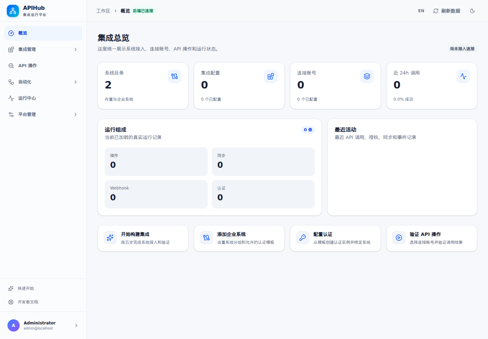
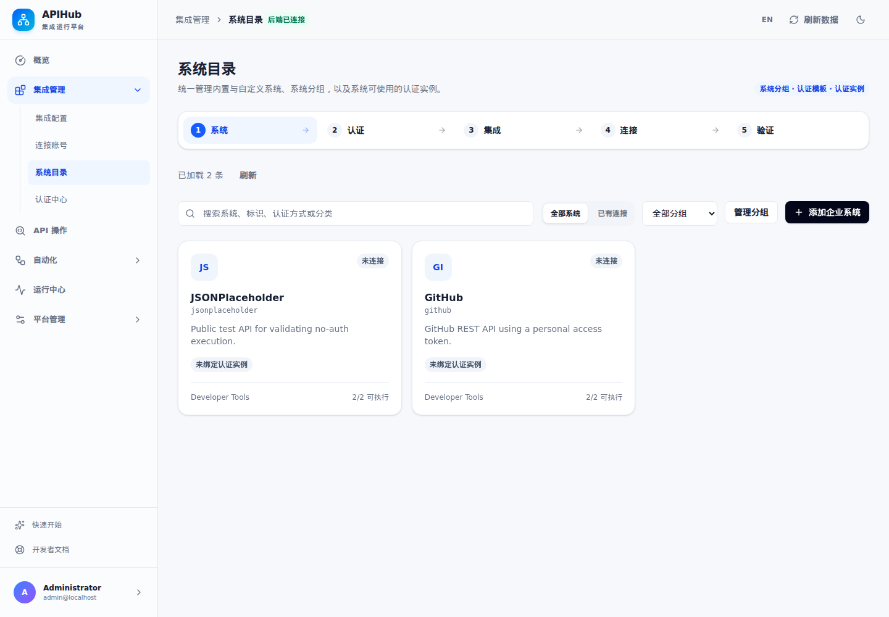
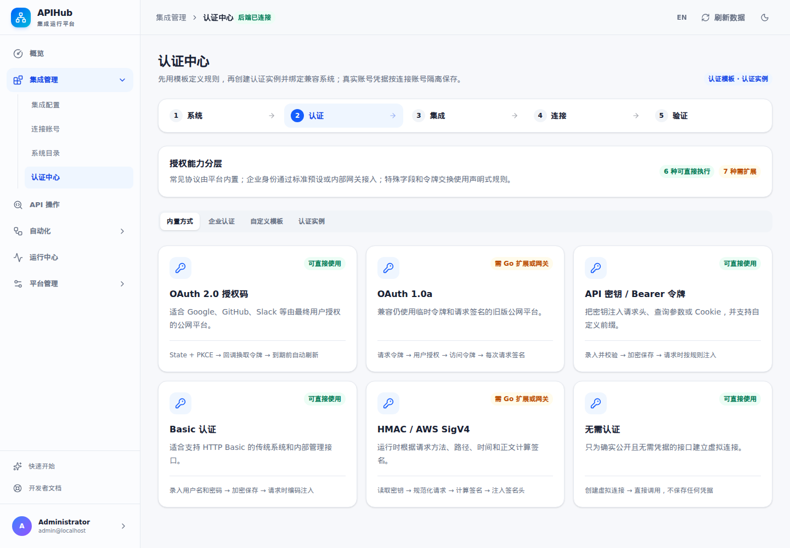
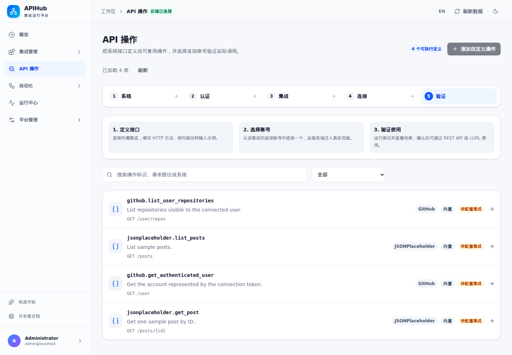
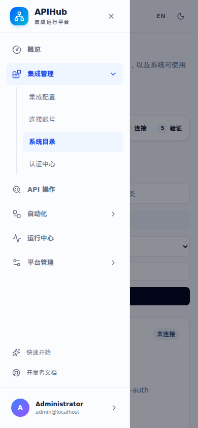
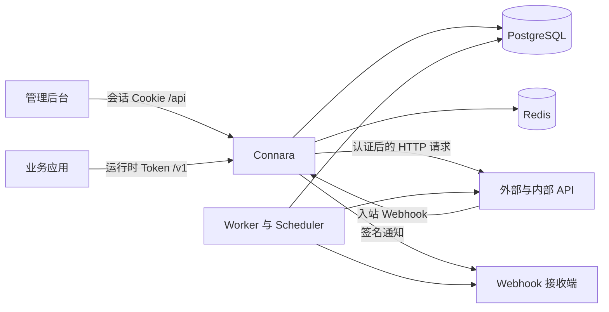

# Connara

[English](README.md) | **简体中文**

**连接 API，自主掌控系统集成。**

Connara 是一个可自行部署的 API 集成平台，用于连接外部服务和企业内部业务系统。在同一个管理后台中完成认证配置、账号连接、API 操作定义、定时同步、Webhook 和运行记录管理。

系统把接口目录与认证、连接管理结合起来。后端使用 Go，React 管理界面直接嵌入应用二进制；基础部署只需要 **一个 Connara 进程、PostgreSQL 和 Redis**。



[](LICENSE)

## 目录

- [系统功能](#系统功能)
- [后台导航](#后台导航)
- [后台截图](#后台截图)
- [系统架构](#系统架构)
- [简单部署](#简单部署)
- [完成第一个接口接入](#完成第一个接口接入)
- [配置说明](#配置说明)
- [作为 Linux 服务常驻运行](#作为-linux-服务常驻运行)
- [运维与升级](#运维与升级)
- [开发与测试](#开发与测试)
- [项目目录与补充文档](#项目目录与补充文档)
- [当前能力边界](#当前能力边界)
- [参与贡献](#参与贡献)
- [许可证](#许可证)

## 系统功能

| 模块 | 可以完成的工作 |
| --- | --- |
| 系统目录 | 浏览内置系统、添加企业内部系统、管理系统分组及支持的认证模板。搜索与筛选由服务端执行。 |
| 认证中心 | 配置可复用的认证模板及系统认证实例，定义凭据字段、Token 请求，以及 Header、Query、Cookie 注入规则。 |
| 集成配置 | 绑定系统、认证实例和 API 基础地址。接入步骤之间传递上下文，往返配置时保留非敏感草稿。 |
| 连接账号 | 保存最终用户、租户或服务账号的凭据，更新凭据、验证访问，并区分配置检查和真实上游验证。凭据使用 AES-256-GCM 加密。 |
| API 操作 | 定义 HTTP 方法、相对路径、输入输出 Schema 和所需权限；校验输入，明确选择集成与连接，测试执行，查看结果并复制对应的 cURL。 |
| 同步任务 | 配置手动或定时任务、记录提取路径、稳定主键、分页和检查点；支持部署、暂停、恢复、查看已保存记录及关联运行。 |
| Webhook | 管理入站事件源和出站通知端点；事件验签与签名、入站去重、失败重试，以及投递尝试详情。 |
| 运行中心 | 查看接口调用、同步、认证及 Webhook 记录；按集成、连接、状态和时间筛选，通过 URL 直达详情，单独展示上游结果未知的情况。 |
| 访问控制与审计 | 签发明确限定操作及连接范围的运行时 Token，撤销 Token，搜索审计记录，导出界面当前已加载的数据。 |
| 团队管理 | 生成有时效的一次性邀请链接，受邀成员接受邀请并设置密码；管理所有者、管理员、开发者和只读成员角色。 |
| 后台交互 | 中英文切换、明暗主题、手机适配、键盘导航、持续错误提示，以及未保存表单保护。 |

### 认证方式支持情况

当前有六种可以直接执行的认证方式：

- 无需认证。
- API Key / Bearer Token，支持配置注入规则。
- HTTP Basic。
- 用户名密码换 Token。
- OAuth 2.0 客户端凭证。
- OAuth 2.0 授权码、PKCE 和 Token 刷新。

目录还提供 OAuth 1.0a、HMAC/AWS SigV4、mTLS、OIDC、JWT 服务账号、SAML/Token Exchange、Kerberos/NTLM 网关等扩展模板。这些方式需要额外实现或网关支持；后台出现模板不代表已经实现对应协议。Webhook 的 HMAC 签名已经实现，与用于 API 认证的 HMAC 扩展模板是独立能力。

## 后台导航

侧栏分为六个主入口，关联页面按组折叠；打开子页面时自动展开对应分组。

| 主入口 | 包含页面 |
| --- | --- |
| 概览 | 集成统计、最近活动和接入快捷入口 |
| 集成管理 | 集成配置、连接账号、系统目录、认证中心 |
| API 操作 | 操作定义、执行测试和运行时调用示例 |
| 自动化 | 同步任务、Webhook |
| 运行中心 | 运行记录、详情和指标 |
| 平台管理 | 访问控制、审计日志、团队管理、平台设置 |

**快速开始**和**开发者文档**固定放在侧栏底部。菜单随前端程序提供，不需要另外导入菜单 SQL。

## 后台截图

以下截图于 **2026-09-17** 从实际运行的后台获取，拍摄时项目尚未从 APIHub 更名为 Connara，因此图片保留原 APIHub 标题。桌面尺寸为 1440 × 1000，手机导航为 390 × 844。截图使用内置目录数据；集成和运行记录需要配置后才会出现，没有填入演示统计。[英文 README](README.md#screenshots) 提供对应的英文界面截图；当前英文界面仍有部分尚未翻译的中文片段。

### 系统目录



### 认证中心



### API 操作



<details>
<summary>查看手机端导航</summary>



</details>

## 系统架构



- **PostgreSQL 保存持久化业务数据**：配置、凭据密文、会话、运行时 Token、运行记录、同步数据和检查点、任务、Outbox 事件、审计记录。
- **Redis 保存临时协调数据**：OAuth state/PKCE、限流窗口和 Token 刷新的分布式锁。
- **前端通过 `go:embed` 内嵌**：正式运行不需要单独启动 Node.js 服务或 Vite。
- **`APIHUB_ROLE=all` 同时启动 HTTP、Worker 和 Scheduler**：需要时可拆分后台处理角色。

技术栈包括 Go/Chi、pgx/PostgreSQL、go-redis、React、TypeScript、Vite、Tailwind CSS 和 TanStack Query。本项目是新的 Go 实现，不是 OpenConnector 或 Nango 的直接兼容替换版。

## 简单部署

```bash
git clone https://github.com/emaisi/connara.git
cd connara
```

下面以 Linux 主机或 WSL 中从源码部署为例。项目命令都在 **仓库根目录 `connara`** 内执行。PostgreSQL 和 Redis 可以安装在本机，也可以使用已经准备好的独立服务。

### 1. 准备运行环境

| 依赖 | 要求 |
| --- | --- |
| Go | 按 [go.mod](go.mod) 使用 `1.27.1` 或兼容的更新工具链 |
| Node.js 与 npm | Node 20.x 至少 `20.19`，或使用 `22.12+`，用于构建前端 |
| PostgreSQL | `15+`，提前创建空数据库和可初始化表结构的账号 |
| Redis | 可访问的 Redis 服务；OAuth state 使用的 `GETDEL` 命令要求 Redis `6.2+` |
| 命令行工具 | Bash、OpenSSL、PostgreSQL 客户端 `psql`；健康检查使用 cURL |

如果 PostgreSQL 安装在本机，可以参考以下命令创建数据库和账号：

```bash
sudo -u postgres createuser --pwprompt apihub
sudo -u postgres createdb --owner=apihub apihub
```

已有数据库和账号时跳过。准备监听 `127.0.0.1:6379` 的 Redis，或者在下面的配置中填写自己的 Redis 地址。

### 2. 构建程序

```bash
npm --prefix web ci
./scripts/build.sh
```

脚本先构建前端，再生成 `bin/` 下的四个程序：`apihub`、`apihub-init`、`apihub-password` 和 `apihub-rotate-keys`。管理界面会一起编入服务二进制。

### 3. 生成本地配置

辅助脚本默认连接 `127.0.0.1:5432`，数据库名与账号均为 `apihub`。建议明确填写实际使用的数据库配置：

```bash
APIHUB_DATABASE_HOST=127.0.0.1 \
APIHUB_DATABASE_PORT=5432 \
APIHUB_DATABASE_NAME=apihub \
APIHUB_DATABASE_USER=apihub \
./scripts/configure.sh
```

脚本会隐藏输入的 PostgreSQL 密码，检查数据库连接，并生成：

- `.env`：数据库与 Redis 配置、管理员密码的 bcrypt 哈希，以及随机凭据加密密钥。
- `.admin-password`：首次登录管理后台的随机密码。

两个文件的权限均为 `600`，且已经加入 Git 忽略。已有 `.env` 时脚本会拒绝覆盖。自动化初始化可以通过 `APIHUB_DATABASE_PASSWORD_FILE` 指定一个受权限保护的数据库密码文件。

初始化前请检查 `.env`，填写实际 Redis 地址、密码和 `APIHUB_PUBLIC_BASE_URL`。脚本生成的是本机 HTTP 地址及 `sslmode=disable` 的 PostgreSQL URL；远程部署应按数据库要求设置 TLS 模式。使用公网 HTTPS 域名时，在初始化前设置真实的公开访问地址。请保留生成的加密密钥和文件中的 Bash 转义格式。

### 4. 初始化数据库并启动

```bash
./scripts/init.sh
./scripts/start.sh
```

`init.sh` 自动执行基础 SQL 和 v2 升级，再写入首次部署的基础数据。`start.sh` 在前台运行已构建程序，检查数据库版本，不重新初始化或覆盖配置。简单试用时保持终端开启；需要长期运行时使用下面的 [Linux 服务配置](#作为-linux-服务常驻运行)。

另开一个终端检查：

```bash
curl --fail --silent --show-error http://127.0.0.1:8080/health/ready
```

预期返回：`{"ok":true}`。浏览器打开 **<http://127.0.0.1:8080/>**，默认账号为 **`admin@localhost`**，初始密码在服务器的 `.admin-password` 文件中查看。如果初始化前修改了 `APIHUB_ADMIN_EMAIL`，使用实际填写的邮箱登录。

### 新部署会自动具备什么

使用默认内置目录初始化时：

| 项目 | 初始内容 |
| --- | --- |
| 数据库 | Schema v2 |
| 工作区和所有者 | 一个默认工作区，一个拥有 owner 角色的管理员 |
| 平台设置 | 公开访问地址、默认运行参数和保留周期 |
| 认证模板 | 13 个模板，包含前面说明的扩展模板 |
| 系统和操作 | GitHub、JSONPlaceholder 两个系统，四个可执行 HTTP 操作定义 |
| 业务配置 | 不自动创建认证实例、集成、账号凭据、同步任务或 Webhook 端点 |

操作定义需要绑定合适的集成及连接后才能调用。**只导入 `docs/postgresql-schema-v1.sql` 不完整**，还需要 v2 升级和 Go 初始化逻辑。新部署和升级都通过 `init.sh` 完成；已初始化工作区重复运行时，不会重新创建初始管理员或覆盖平台设置。

## 完成第一个接口接入

内置 JSONPlaceholder 可以用来体验无需认证的公共接口。真实调用需要服务器能够访问该服务。

1. 打开**集成管理 → 系统目录**，选择 **JSONPlaceholder**。
2. 在**认证中心**中创建就绪的**无需认证**实例，并绑定该系统。
3. 创建**集成配置**，选择该认证实例，基础地址填写 `https://jsonplaceholder.typicode.com`。
4. 为集成创建**连接账号**并填写最终用户标识。无需认证的连接不要求 API 密钥；从界面复制连接标识备用。
5. 在 **API 操作 → `jsonplaceholder.get_post`** 中选择对应集成和连接，输入 `{"id":1}` 执行测试；查看结果，通过运行链接进入运行中心定位日志。

保存连接并不代表上游调用已经成功。配置验证路径后可以执行只读探测；指定集成和连接完成一次成功的 Action 调用后，快速开始的最后一步才会完成。

业务程序需要调用时，由 owner/admin 在**平台管理 → 访问控制**创建运行时 Token，明确授权对应操作及连接。可以直接复制后台生成的调用命令，也可以参考：

```bash
read -r -s -p 'Runtime token: ' APIHUB_RUNTIME_TOKEN
printf '\n'
curl --fail-with-body --request POST \
  'http://127.0.0.1:8080/v1/actions/jsonplaceholder.get_post' \
  --header "Authorization: Bearer ${APIHUB_RUNTIME_TOKEN}" \
  --header 'Content-Type: application/json' \
  --data '{"integrationId":"REPLACE_WITH_INTEGRATION_ID","connectionKey":"REPLACE_WITH_CONNECTION_KEY","input":{"id":1}}'
unset APIHUB_RUNTIME_TOKEN
```

把两个占位标识替换为当前后台中的集成 ID 和连接标识。运行时 Token 与管理员登录会话是两套凭据。运行时请求可以携带 `Idempotency-Key`；同一个键只用于同一请求的重试。

## 配置说明

公开项目名称为 **Connara**。首个开源版本保留 `apihub` 二进制名称、`APIHUB_*` 环境变量、Go 模块名和已有数据库结构，兼容此前的本地部署。

完整配置可参考 [`.env.example`](.env.example)。启动脚本按 Bash 语法加载 `.env`，生成的转义格式不应直接当作通用 systemd `EnvironmentFile` 使用。

| 环境变量 | 用途 |
| --- | --- |
| `APIHUB_ADDRESS` | HTTP 监听地址，默认 `:8080`；同机反向代理场景可设为 `127.0.0.1:8080`。 |
| `APIHUB_DATABASE_URL` | 运行进程使用的 PostgreSQL 连接地址。 |
| `APIHUB_MIGRATION_DATABASE_URL` | 可选的独立 DDL 账号连接地址，仅 `apihub-init` 使用；未设置时沿用运行账号。 |
| `APIHUB_REDIS_ADDR`、`APIHUB_REDIS_PASSWORD`、`APIHUB_REDIS_DB` | Redis 地址、可选密码和数据库编号。 |
| `APIHUB_PUBLIC_BASE_URL` | 外部可以访问的公开地址，用于集成回调，并在首次初始化时写入平台设置。 |
| `APIHUB_ENCRYPTION_KEY` | Base64 编码的 32 字节凭据加密密钥，解密已有凭据必须使用匹配的密钥。 |
| `APIHUB_ENCRYPTION_KEY_VERSION`、`APIHUB_PREVIOUS_ENCRYPTION_KEYS` | 当前密钥版本，以及密钥轮换期间保留的旧版本密钥。 |
| `APIHUB_ADMIN_EMAIL`、`APIHUB_ADMIN_PASSWORD_HASH` | 首次管理员邮箱及 bcrypt 密码哈希；初始化后修改它们不会重置已有账号。 |
| `APIHUB_WORKSPACE_ID`、`APIHUB_WORKSPACE_SLUG`、`APIHUB_WORKSPACE_NAME` | 工作区标识和首次初始化名称。 |
| `APIHUB_ROLE` | `all`（默认）、`api`、`worker` 或 `scheduler`。 |
| `APIHUB_ALLOWED_PRIVATE_CIDRS` | 允许上游 HTTP 请求访问的私网范围，多个 CIDR 用逗号分隔。 |
| `APIHUB_CATALOG_DIR` | 可选 JSON 系统目录，首次初始化前设置，可导入更多目录条目。 |
| `APIHUB_ENV_FILE` | Shell 脚本使用的其他配置文件路径。 |

部分配置会保存到 PostgreSQL。初始化后更换域名时，应同时修改环境变量和后台**平台设置**，保持生成的 URL 一致。已有工作区不会因为重启或再次初始化，就重新导入系统目录。

### 角色权限

| 角色 | 权限范围 |
| --- | --- |
| Owner / 所有者 | 管理平台和所有者身份；必须至少保留一位所有者。 |
| Admin / 管理员 | 管理集成、运行时 Token、团队和平台设置；所有者身份的调整仍由 owner 执行。 |
| Developer / 开发者 | 管理系统、认证、集成、连接、操作、同步和 Webhook；不能管理运行时 Token、团队或平台设置。 |
| Viewer / 只读成员 | 浏览数据，不能保存配置或执行运行操作。 |

邀请链接有效期为七天，受邀成员打开链接后设置密码并激活账号。后台只生成链接供手动分享，不会自动发送邀请邮件。

## 作为 Linux 服务常驻运行

确认前台启动正常后，用 `Ctrl+C` 停止该进程。下面假设应用目录已放到 **`/opt/apihub`**，其中包含构建后的 `bin/`、启动脚本和 `.env`，并由名为 **`apihub`** 的 Linux 服务账号拥有。`.env` 仅允许该账号读取。构建机器应与部署目标使用相同的操作系统和架构。

将以下内容保存为 `/etc/systemd/system/apihub.service`：

```ini
[Unit]
Description=Connara integration platform
Wants=network-online.target
After=network-online.target

[Service]
Type=simple
User=apihub
Group=apihub
WorkingDirectory=/opt/apihub
ExecStart=/opt/apihub/scripts/start.sh
Restart=on-failure
RestartSec=5
TimeoutStopSec=75
UMask=0077

[Install]
WantedBy=multi-user.target
```

启动并设置开机运行：

```bash
sudo systemctl daemon-reload
sudo systemctl enable --now apihub
sudo systemctl status apihub --no-pager
sudo journalctl -u apihub -n 100 --no-pager
```

公网访问时，在反向代理处处理 HTTPS，将请求转发到 Connara，并保留公开 Host 和 `X-Forwarded-Proto`；`APIHUB_PUBLIC_BASE_URL` 应与公开地址一致。配置数据库、Redis 的访问权限。备份时同时保留 **PostgreSQL 数据和加密密钥**，只有数据库备份无法解密连接凭据。

## 运维与升级

### 健康检查与常见问题

| 检查项或现象 | 含义与处理 |
| --- | --- |
| `GET /health/live` 返回 200 | HTTP 进程存活。 |
| `GET /health/ready` 返回 `{"ok":true}` | PostgreSQL 和 Redis 检查通过；`/health` 同样执行就绪检查。 |
| 提示 `schema version ... unsupported` | 启动前，使用有迁移权限的账号运行新版本 `scripts/init.sh`。 |
| 就绪检查返回 `component: redis` | 检查 Redis 地址、密码和连通性；此时页面可能仍能打开，但 OAuth state、锁和需要限流的请求不可正常使用。 |
| 5173 页面请求 API 失败 | Vite 只提供开发服务，还需要启动监听 8080 的 Go 后端。 |
| 企业内网接口被拒绝 | 在 `APIHUB_ALLOWED_PRIVATE_CIDRS` 中添加实际需要的网段或单机 CIDR，例如 `10.20.0.0/16`。 |
| 连接显示已配置、尚未验证 | 设置上游验证路径或实际执行 Action；配置保存成功不能代替上游调用成功。 |
| 页面仍显示旧版本 | 前端和 Go 二进制都需要重新构建，然后重启；前端资产保存在二进制中。 |
| 运行结果未知 | 上游可能已执行；重试有副作用的请求前先在上游核对。 |

### 更新已有部署

先备份数据库，保留原 `.env`、密码文件和加密密钥。在维护窗口停止旧服务后，由应用所属账号在更新后的源码目录执行：

```bash
npm --prefix web ci
./scripts/build.sh
./scripts/init.sh
```

然后重启服务并检查 `/health/ready`。不要对已有 `.env` 重新运行 `configure.sh`，也不要在常规升级中重新生成加密密钥。需要分离运行与 DDL 账号时，运行账号只需业务表权限及 `schema_migrations` 读取权限，迁移凭据单独管理。

### 后台任务与事件投递

单机部署使用 `all` 最简单。`api` 不运行后台循环，`worker` 处理任务，`scheduler` 负责调度和清理。每种角色仍会启动 HTTP 监听，因此同机拆分多个进程时，应使用不同监听地址或端口，并保持工作区、数据库、Redis 和加密配置一致。

Webhook 使用签名事件信封，按至少一次方式投递。接收端应对原始正文验签，并按事件 ID 去重。签名 Header、重试行为、同步分页和密钥轮换见[升级与 Webhook 协议说明](docs/hardening-upgrade.md)。

## 开发与测试

先使用已初始化配置启动 Go 后端，再打开另一个终端：

```bash
cd web
npm run dev
```

访问 <http://127.0.0.1:5173/>。Vite 把 `/api`、`/health`、`/v1` 代理到 `127.0.0.1:8080`。OAuth 回调和入站 Webhook 应使用配置好的后端公开地址进行测试。

在仓库根目录运行项目检查：

```bash
# Go vet、Go race 测试、前端格式/lint/测试以及生产构建
./scripts/check.sh

# 自动创建临时 PostgreSQL 和 Redis；不加载项目 .env
./scripts/test-integration.sh
```

集成测试脚本需要 `initdb`、`pg_ctl`、`pg_config`、`redis-server` 和 Python 3。PostgreSQL 工具不在默认位置时，通过 `APIHUB_TEST_PG_BIN` 指向包含 `initdb`、`pg_ctl` 的目录。依赖数据库的 Go 测试需要这一集成环境，单独运行 `go test` 可能跳过这些测试。

## 项目目录与补充文档

```text
cmd/                         服务、初始化、密码及密钥轮换工具
internal/authn/              认证与 Token 生命周期
internal/background/         Worker、Scheduler 和同步逻辑
internal/catalog/            内置及外部系统定义
internal/executor/           HTTP 操作执行与请求防护
internal/httpapi/            管理 API、运行时 API、OAuth 与 Webhook
internal/store/              PostgreSQL 查询、基础 SQL 和版本迁移
internal/webui/static/       编入 Go 二进制的前端构建产物
web/                         React 管理后台
scripts/                     配置、构建、初始化、启动与检查脚本
docs/                        设计说明、升级说明和后台截图
```

- [PostgreSQL 与 Redis 后端设计](docs/postgresql-redis-backend-design.md)。
- [基础 SQL](internal/store/schema.sql)及 [v2 增量迁移](internal/store/migrations/002_hardening.sql)。
- [升级步骤与 Webhook 协议](docs/hardening-upgrade.md)：历史实施状态以该文档记录日期为准。
- [截图来源说明](docs/screenshots/README.md)。

## 当前能力边界

默认包包含两个系统和四个 HTTP 操作，并不包含其他项目完整的服务目录。接入其他系统时，需要准备兼容的认证配置和接口定义，并验证实际适配和服务商授权流程。

通用代理端点 `/v1/proxy/*` 对已认证运行时请求返回 **410 Gone**。MCP 服务、生成式客户端 SDK/CLI、OpenAPI 导出尚未作为可用功能交付。`bin/` 下的命令行程序是服务管理工具，不是业务客户端 SDK。已实现的 API 范围可在后台开发者文档中查看。

## 参与贡献

欢迎在 [emaisi/connara](https://github.com/emaisi/connara) 提交 Issue 和 Pull Request。请说明受影响的流程、预期行为及复现步骤，并移除日志和截图中的凭据、私有业务数据。提交修改前运行前面介绍的相关检查。

疑似安全漏洞请使用仓库的私密漏洞报告功能，避免直接发布到公开 Issue。

## 许可证

Connara 使用 [Apache License 2.0](LICENSE) 开源。依赖包及引用的上游项目保留各自的许可证。
