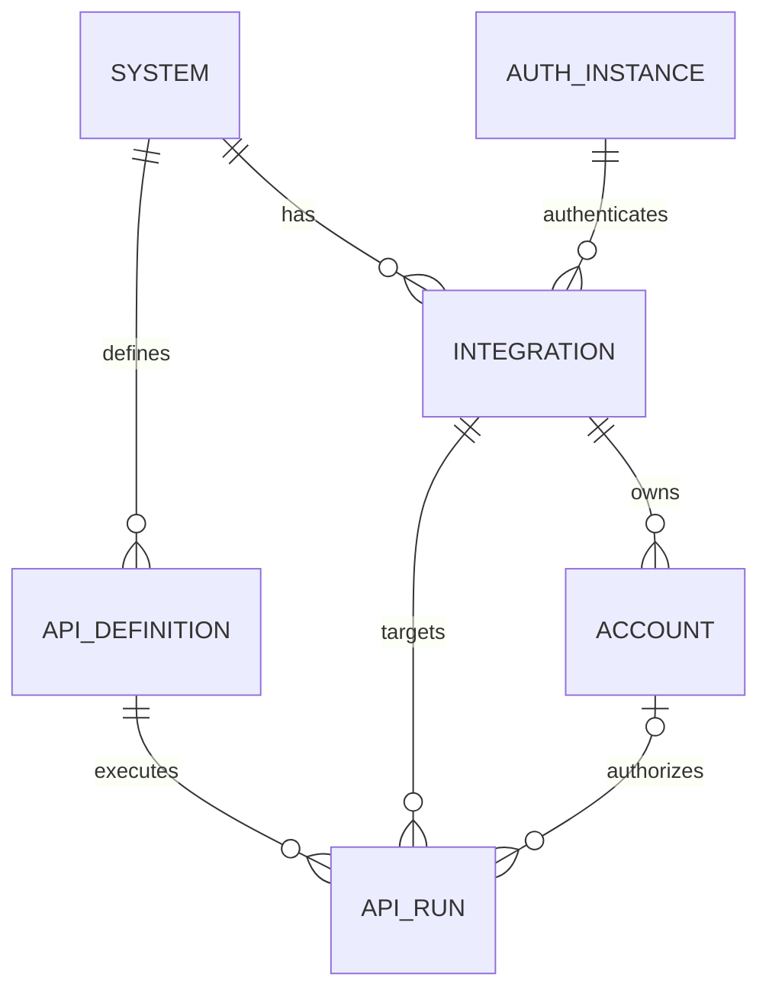

# API、系统、集成与账号重新设计开发方案

> 状态：本期开发与本地验收已完成。2026-10-03 核查发现的 8 项问题及幂等清理问题均已修复，完整集成测试无排除项通过。真实 Windows 上游验收独立记录；详见 `api-system-integration-completion-audit.md`。
> 设计日期：2026-10-02；实施验收：2026-10-03。
> 范围：重新设计 API 定义、环境配置、账号管理、请求预览与执行测试。
> 前提：不受当前 UI 和已有数据兼容约束；不包含历史数据迁移方案。现有认证协议能力继续复用。

## 1. 目标与设计结论

API 属于系统；集成代表系统的一个访问环境；账号属于集成，提供访问该环境的凭据。创建 API 不依赖集成、账号或真实认证成功。执行 API 必须明确绑定集成，并在需要认证时绑定有效账号。

以用户实际遇到的问题为验收起点：

- 创建 API 时不再要求先添加账号。
- 同一系统的 API 可以在不同环境执行，无须复制定义。
- 用户执行前能看见本次请求究竟访问哪个地址。
- 修正集成地址不需要重新建立整个集成。
- 保存配置、结构校验、真实认证和业务 API 验证分别呈现结果。
- 配置好的私有网络地址不需要逐个追加环境变量。
- 常规操作使用表单；JSON 和高级选项按需展开。

不纳入本期：自动导入 OpenAPI、环境变量模板语言、复杂请求脚本、任意文件上传、批量 API 测试、自动生成 SDK、自动迁移旧数据。

## 2. 当前代码事实与待改进点

本节记录实施前的基线，仅作为实现定位依据；当前实现见第 16 节。

| 当前位置 | 已确认行为 | 目标变化 |
|---|---|---|
| `web/src/pages/actions.tsx` | 创建 API 必须选择就绪集成，保存 systemId 和 integrationId | 创建只选择系统 |
| 同上 | 自定义 API 的执行集成下拉框限制为创建时的集成 | 可以选择同系统的所有可执行集成 |
| `internal/httpapi/admin.go` 的 saveAction | systemId 必填，integrationId 可选 | 定义接口取消 integrationId |
| `internal/store/catalog.go` 的 SaveAction | 集成关联可选，并校验系统归属 | API 固定归系统 |
| `internal/httpapi/runtime.go` | 执行优先取请求集成，缺省回退 API 集成 | 执行必须明确提供集成，不依赖定义内默认值 |
| `internal/executor/executor.go` | GET/HEAD 剩余输入成为 query，其余方法成为 JSON body | 参数位置显式定义，共用预览与执行构建器 |
| `web/src/pages/integrations.tsx` | 有账号时禁止修改地址或认证实例 | 地址允许修改，按版本使验证失效；认证实例更换采用明确处理流程 |

只移除按钮不能解决对象归属、环境复用或地址来源不清的问题，需要同时调整模型、后端执行和 UI。

## 3. 业务对象与边界



### 3.1 系统

描述一个产品或一组采用相同接口契约的服务，例如 ISGS。保存名称、标识、描述、图标和可选 API 分组。不保存运行地址和账号凭据。

不同环境通常使用同一系统；若接口契约已经根本不同，应建立独立系统，而不是在一个 API 中加入按环境切换的方法或路径。

### 3.2 API 定义

保存所属系统、名称、唯一标识、HTTP 方法、接口路径、参数定义、响应检查、输入示例和执行策略。不保存集成 ID、账号 ID、绝对地址、Token 或密码。

标识在工作空间和系统内唯一。对外定位使用 systemKey + apiKey 或不可变 API ID，禁止仅凭可能重复的名称查找。

### 3.3 集成

表示某系统的一个访问环境，保存名称、环境标签、基础地址、认证实例和启停状态。例如“ISGS 测试环境”“ISGS 生产环境”。

环境标签使用测试、生产、自定义三个常用选项，仅用于识别，不自动改变权限或认证协议。

### 3.4 认证实例与账号

认证实例定义如何获取和注入认证信息；账号保存实例要求的用户凭据。账号继续归属于集成，避免凭据在不同环境间自动复用。

认证实例中 Token URL 与集成 API 地址分别配置，界面明确区分“认证服务地址”和“业务 API 基础地址”。无认证实例允许账号为空。

## 4. 导航与页面结构

一级导航保持精简：系统、API、集成、认证中心、运行记录。系统详情聚合相关对象，独立页面提供全局搜索和管理。

### 4.1 系统详情

顶部：系统名称、说明、状态、主要操作“添加 API”。

内容标签：API、集成、系统设置。API 标签默认展示，集成标签用于查看这个系统有哪些环境。

从系统详情添加 API 时自动填写所属系统且不重复询问。从全局 API 页面添加时需要选择系统。

账号的创建和维护统一在认证中心的账号页面。集成详情可以展示关联账号及“查看账号”链接，不设置“添加账号”按钮，也不在保存集成后自动跳转创建账号。

### 4.2 全局 API 页面

顶部：“API”“添加 API”；筛选为系统、分组、状态和搜索。每行显示名称、方法、路径、系统和定义状态。

API 定义状态仅为草稿、可调用、停用。可调用表示定义校验通过且启用，不代表任何环境已通过上游验证。列表不使用“认证成功”“可验证”等含混标签。

选择 API 后进入独立详情页，避免把复杂编辑和测试塞进多层弹窗。详情页标签为“定义”“测试”“运行记录”。

### 4.3 集成页面

列表显示集成名称、系统、环境标签、业务地址、启停状态、可用账号数量。地址允许复制，窄屏省略显示但可展开查看完整值。

详情使用“连接设置”“账号”两个区域。连接设置包含基础地址、认证实例和保存按钮；账号区域只展示状态及查看链接。

新建集成只填写系统、名称、基础地址和认证方式。保存结束即完成，不强制添加账号或立即调用上游。

### 4.4 账号页面

筛选：系统、集成、验证状态。添加账号时先选集成，再显示对应凭据字段。

按钮使用“保存账号”和独立“验证”。保存成功明确提示“账号已保存，尚未验证”；验证结果可以同时包含认证与业务验证。

无认证集成不要求创建占位账号。

## 5. 添加与编辑 API 的 UI

### 5.1 默认可见内容

按顺序展示：所属系统、API 名称、API 标识、请求方法和路径、参数表格。

方法支持 GET、POST、PUT、PATCH、DELETE、HEAD。路径默认 `/` 开头，不接受绝对 URL。方法旁选择请求体类型，仅在需要时出现：无、JSON、表单。

参数表格列：参数名、位置、类型、必填、示例。默认只显示常用类型字符串、数字、布尔；对象和数组在 JSON body 参数中按需选择。

URL 中输入 `{resourceId}` 后自动生成对应必填 path 参数。删除占位符时提示确认删除对应参数，不能留下隐藏的无效映射。

GET/HEAD 默认 query 参数且无请求体；POST 等默认 JSON body，也允许 query。切换方法或体格式不得静默丢弃用户输入；需要转换或清空时给出具体影响。

### 5.2 高级选项

默认折叠：固定请求头、响应校验、超时及执行策略、输入输出 Schema。

Schema 由参数表格生成，可查看；选择自定义 Schema 后明确切换模式，由后端检查 Schema 和参数映射的一致性，不允许两个编辑器同时成为权威来源。

不允许 API 定义填写 Authorization、Cookie、API Key 或其他认证秘密。认证相关值来自账号和认证实例。普通固定头如 Accept、非敏感业务标识可以配置。

### 5.3 保存流程

主要按钮“保存”，次要按钮“取消”。保存只做服务器配置校验，不发起上游请求。

保存成功进入定义详情，可点击“测试”。缺少集成时测试页面提示“此系统尚未配置访问环境”，提供“配置集成”；缺少账号时提供“前往账号管理”。这些情况不阻止保存 API。

失败保留输入并定位字段。未保存提示只在确有变化时触发；保存成功清除 dirty 状态。

## 6. API 测试页面重新设计

桌面双栏：左侧目标和参数，右侧请求预览与结果；移动端按同样顺序纵向排列。

```text
查询资源                         定义 | 测试 | 运行记录
执行集成 [ISGS 测试环境 v]        请求预览
执行账号 [服务账号 v]            GET http://172.26.16.1:18001/api/v1/resources
                                Query: page=1&pageSize=20
page     [1 ]                    认证：服务账号 · Bearer（值隐藏）
pageSize [20]
[运行测试]                       结果：尚未执行
```

### 6.1 选择规则

- 仅列出当前系统下启用且配置有效的集成。
- 从集成上下文打开测试时预选该集成；否则唯一候选自动选中，多候选要求选择。
- 账号只列出所选集成下启用且验证有效的账号；唯一候选自动选中。
- 切换集成立即清除账号、旧预览和当前展示结果，重新加载候选。
- 无认证集成隐藏账号下拉，显示“无需认证”。
- 有账号但全部待验证时显示具体状态，不再误导用户重新添加账号。
- 选择可保存在用户偏好中，但不成为 API 定义字段，不保存凭据，不自动代替服务端版本检查。

### 6.2 请求预览

服务端根据定义、输入和所选集成生成预览，前端不自行拼接另一套 URL。

展示方法、完整编码后的 URL、参数位置、非敏感请求头、请求体和认证来源。含秘密的 query/header/body 值统一脱敏。预览不兑换 Token，不写认证缓存，不创建运行记录。

执行提交与预览使用同一 API/集成/账号版本。版本变化返回 409 并重新展示新预览，禁止沿用旧地址悄悄执行。

### 6.3 地址拼接的唯一契约

集成基础地址只允许 origin 加可选路径前缀，不允许 userinfo、query 或 fragment。

API 路径以 `/` 开头，但在本产品中定义为“基础地址路径前缀下的接口路径”。统一去除接缝处多余斜杠，不使用会覆盖基础路径的默认 ResolveReference 语义。

| 基础地址 | API 路径 | 实际请求 |
|---|---|---|
| `http://host:18001` | `/api/v1/resources` | `http://host:18001/api/v1/resources` |
| `http://host:18001/api-hub` | `/resources` | `http://host:18001/api-hub/resources` |
| `http://host:18001/api-hub/` | `/resources` | `http://host:18001/api-hub/resources` |

拒绝 `//host`、路径穿越和编码后逃逸基础路径的输入；path 参数按单个路径段编码，不能借参数注入另一个主机或路径结构。GET query 使用标准 URL 编码；HEAD 不读取响应体。

### 6.4 结果展示

顶部明确显示成功、失败或结果未知；下方分为请求详情、响应、检查结果。

- 成功：满足 HTTP 与配置的业务检查。
- 失败：明确的本地校验失败、网络策略拒绝、连接拒绝、上游拒绝或响应检查失败。
- 结果未知：请求可能已发出，但无法确认上游是否完成，例如写请求发送后超时。

结果显示运行 ID、请求 ID、耗时、HTTP 状态、失败阶段和可读原因。策略拦截不能统一标记为“未知”。后端依据传输阶段记录能否确认请求未发送，不能仅匹配错误字符串。

Token 获取成功与业务 API 成功分别展示。HTTP 200 但业务码不符合条件，整体仍失败。没有响应约束时只标记 HTTP 检查通过，不声称响应结构有效。

写操作显示明确方法和目的地址。默认只执行一次；结果未知时不自动重试。只在用户显式标记并满足上游幂等契约时支持重试策略。

## 7. 请求与响应配置契约

### 7.1 请求定义示例

```json
{
  "systemId": "sys-isgs",
  "apiKey": "list_resources",
  "name": "查询资源",
  "status": "enabled",
  "request": {
    "method": "GET",
    "path": "/api/v1/resources",
    "bodyFormat": "none",
    "parameters": [
      {"name": "page", "in": "query", "type": "integer", "required": false, "default": 1},
      {"name": "pageSize", "in": "query", "type": "integer", "required": false, "default": 20}
    ],
    "headers": []
  },
  "response": {
    "statusCodes": [200],
    "successCondition": {"path": "$.code", "operator": "equals", "value": 0},
    "schema": {"type": "object", "required": ["code", "data"]}
  },
  "execution": {"timeoutMs": 30000, "retryMode": "none"}
}
```

参数位置支持 path、query、header、body。path 必须标量且必填；JSON body 支持对象字段映射，表单仅支持标量。数组 query 明确使用 repeated 格式，不采用猜测或逗号自动拼接。名称冲突、JSON 路径重叠和保留头冲突在保存时拒绝。

所有输入先校验类型、必填、范围与未知字段，再建立请求。布尔 false 和数字 0 不能当作未填写。默认值在共享构建器中应用。

### 7.2 响应检查

检查顺序：传输完成 → HTTP 状态 → 可选 JSON 解析 → 业务条件 → 可选输出 Schema。

支持已有 JSON 路径读取能力，包括数组下标。比较保留类型，字符串 `"0"` 不等于数字 `0`；数值比较避免仅按 JSON 文本比较。错误指出失败路径和预期类型，敏感字段始终隐藏。

JSON Schema 使用项目已有校验器和支持子集，不新建独立校验引擎；不支持的关键字保存时明确报错，不能忽略后仍显示结构检查通过。

非 JSON 响应支持 HTTP 状态检查和受限文本展示；配置 JSON 检查而返回非 JSON 时失败。缓冲大小沿用当前 4 MiB 上限，并在 UI 提示超限，文件流式处理不在本期。

## 8. 集成地址修改与网络访问

### 8.1 修改地址

允许已有账号的集成修改业务地址。保存前显示受影响账号数与“保存后需要重新验证”的具体说明。

事务内保存地址、增加 targetVersion、使该集成所有账号的目标验证失效。账号凭据保留；业务地址变化不盲目清除仍属于同一认证实例的认证缓存，但必须重新完成目标验证后才允许业务执行。

修改认证实例属于另一种操作：若有账号，必须提示其凭据结构将改变；本期要求先停用并重新配置这些账号，不自动把旧凭据交给新实例。

正在运行的请求保持自己的不可变目标快照，不被保存操作中途切换地址。保存后的新请求使用新版本。

### 8.2 网络策略

获得集成管理权限的用户保存的基础地址成为该集成的受信目标，不需要逐域名或 IP 配置 env。认证 URL 仍由认证实例的受信目标机制管理，两者不能互相授权任意主机。

受信范围固定到 scheme、host、port；共享请求构建器限制路径前缀。普通调用用户不能提交完整目标 URL或覆盖 Host。认证凭据不会因重定向发送到其他 origin。

复用已有 ConfiguredEndpointClient 的思路，将相同能力扩展到业务集成目标：解析 DNS 并固定本次连接地址；禁用可能改变目标的环境代理；重定向默认禁止；不得全局关闭网络保护。云元数据和其他平台管理端点仍按部署级硬性策略拒绝。

WSL 与 Windows 的可访问地址由用户在集成中设置，平台不把 localhost 自动替换为网关，也不硬编码网关地址。连接失败提示实际目标，并链接到该集成的地址配置。

## 9. 验证状态与版本模型

启停状态与验证状态分开，避免一个 ready 字段同时表达所有含义。

| 对象 | 生命周期 | 验证信息 |
|---|---|---|
| API | draft/enabled/disabled | 配置合法性；按运行记录体现真实结果 |
| 集成 | enabled/disabled | configurationVersion、targetVersion |
| 账号 | enabled/disabled | credentialRevision、authVerifiedRevision、targetVerifiedVersion、验证时间与原因 |

认证成功代表凭据可按实例流程使用；目标验证成功代表在当前集成目标上验证通过。静态凭据只有真实验证请求成功后才有有效验证记录，结构检查不能代替它。

认证方式无需业务验证时，可由成功的真实 Token 请求满足认证检查，但集成地址变更后仍需显式目标验证。实例允许配置一个安全验证接口；没有时用户可以从本系统的全部 API 中显式选择可调用接口进行验证，支持 POST 等查询接口。草稿和停用接口显示但不可选；界面说明验证将真实发送请求，避免选择修改数据的接口。禁止后台自动选择接口验证账号。

验证有效性根据版本派生，不批量伪造账号状态。敏感修订递增与验证结果写入原子化，旧验证请求完成后不能覆盖新凭据版本的结果。

## 10. 后端接口设计

路由名称为目标契约，实现时统一沿用项目命名规范，不要求为了文案重命名全部内部 action 类型。

| 接口 | 用途 |
|---|---|
| `GET /api/systems/{id}/apis` | 查看系统 API |
| `POST /api/apis` | 创建定义，仅要求系统 |
| `GET /api/apis/{id}` | 获取定义和版本 |
| `PUT /api/apis/{id}` | 更新，要求 expectedVersion |
| `POST /api/apis/{id}/preview` | 无副作用预览 |
| `POST /api/apis/{id}/test` | 执行并创建运行记录 |
| `GET /api/apis/{id}/execution-options` | 返回当前用户可执行的集成及账号 |
| `PUT /api/integrations/{id}` | 修改配置并使目标验证失效 |
| `POST /api/accounts/{id}/verify` | 真实认证和可选业务验证 |

执行请求示例：

```json
{
  "integrationId": "int-isgs-test",
  "accountId": "account-service",
  "input": {"page": 1, "pageSize": 20},
  "expectedApiVersion": 3,
  "expectedIntegrationVersion": 5,
  "expectedAccountRevision": 2
}
```

无认证时 accountId 和账号版本省略。执行端必须检查 API、系统、集成、账号在同一工作空间，集成属于 API 系统，账号属于集成，以及当前用户的对象权限。前端筛选不能替代这些检查。

错误使用稳定 code、阶段、可读 message、requestId、字段错误；内部数据库详情和含凭据 URL 不对外回显。400 输入不合法，403 权限不足，404 无可见资源，409 版本冲突，502 明确上游失败，504 超时；运行业务结果与 HTTP 管理接口状态分别表达。

## 11. 数据与运行快照

API 表保留 system_id，删除运行绑定 integration_id；唯一键采用 workspace_id、system_id、api_key。request_config、response_config、execution_config 分别为有版本的结构化配置。

集成增加 configuration_version 和 target_version；账号增加 credential_revision 及版本化验证记录。外键归属检查、工作空间限制和版本条件更新不可只放在 UI。

每次执行保存 API ID/版本、集成 ID/版本、账号 ID/凭据修订、最终目标脱敏快照、请求映射、检查结果和阶段时间。运行详情显示当时地址，不能用最新集成地址重算历史记录。

确需重放时使用权限校验后的不可变加密执行快照；普通审计记录只有脱敏摘要，不包含可直接复用的凭据。对象改名不影响 ID 关联。

## 12. 权限与交互规范

复用当前 RBAC，分别检查定义管理、集成管理、账号管理和 API 执行权限。预览也受目标和 API 可见性限制；保存地址是受信目标授权操作，需要审计。

移动端 320/390 px 不产生页面横向溢出；参数表转为逐项卡片。桌面双栏不强制移动端保留两栏。JSON 区域可局部滚动，不能把整个页面撑宽。

所有输入有 label、错误可由键盘定位、切换目标后焦点合理、弹窗可关闭并回到触发位置。中英文统一状态语义。请求预览包含完整地址，但脱敏秘密不能通过复制、HTML 属性或日志泄漏。

## 13. 开发拆分

### 阶段一：模型与共享请求构建器

实现系统级 API 模型、明确路径拼接、参数位置映射、响应检查、版本校验与受信业务目标客户端。构建器同时服务预览、真实执行和工作流调用，避免各自拼 URL。

交付标准：后端不依赖 API 集成字段，可在同系统两个集成执行同一 API，跨系统/跨工作空间请求被拒绝。

### 阶段二：API 创建与详情 UI

实现系统入口、全局 API 页、表单编辑、折叠高级配置、独立保存流程。删除创建时强制集成及保存后自动验证的逻辑。

交付标准：没有集成和账号也能保存合法 API，失败保留输入，保存成功不显示认证成功。

### 阶段三：测试控制台与运行记录

实现执行选项、唯一候选自动选择、服务端脱敏预览、版本绑定执行、失败阶段、历史目标快照。

交付标准：切换环境时无需复制 API；预览地址与实际请求完全一致；失败与未知正确区分。

### 阶段四：集成编辑与账号验证

实现地址可编辑、目标版本失效、凭据版本验证、账号页统一管理、无需 env 的集成目标授权。

交付标准：修改地址后账号不会直接沿用旧目标验证；重新验证通过后恢复执行。

### 阶段五：系统级联动与验收

更新系统详情、工作流和运行调用方，使其明确携带执行集成与账号。检查删除、停用、权限、并发修改和多语言。

不做历史迁移；开发使用独立新建测试数据。部署若需要重建业务数据或删除旧表，属于单独的部署方案和明确操作授权，不由本设计自动授权。

## 14. 验收测试矩阵

| 场景 | 必须满足 |
|---|---|
| 系统没有集成 | API 可保存，测试提示配置环境 |
| 一个系统两个集成 | 同一 API 可切换执行，定义不复制 |
| 一个可用账号 | 自动选中；多个账号不擅自选择 |
| 集成无认证 | 无需占位账号即可执行 |
| 已有账号待验证 | 显示验证原因与入口，不提示重复添加 |
| 预览 GET query | 中文、空格、数组和路径参数编码与实际请求一致 |
| 基础地址含路径前缀 | 前缀保留，预览与执行共享相同 URL |
| POST form/JSON | body 与 Content-Type 正确，false/0 不丢失 |
| HTTP 200 业务失败 | 整体失败，具体条件可定位 |
| HTTP 200 结构错误 | 配置 Schema 时失败，无 Schema 时不宣称结构通过 |
| 保存地址后执行旧预览 | 409，刷新目标后重试 |
| 地址修改期间验证完成 | 旧版本结果不能覆盖新状态 |
| 网络策略拦截/连接拒绝 | 明确失败且确认未发送，不统一显示 unknown |
| 写请求发送后超时 | unknown，不自动重复执行 |
| 私有目标与重定向 | 已授权目标可访问，未授权目标和跨 origin 跳转被拒绝 |
| 运行后修改集成地址 | 历史运行仍展示当时地址 |
| 账号凭据与 Token | 预览、复制、日志和响应均无明文秘密 |
| 移动端与键盘 | 320/390 px 无页面溢出，表单及测试可键盘操作 |

验证采用 Go 单元测试、隔离 PostgreSQL/Redis 集成测试和浏览器桌面/移动端检查。使用受控上游分别模拟成功、错误结构、业务拒绝、连接失败、超时和重定向。真实 Windows/WSL 上游测试单独记录，不能用模拟服务成功代替真实环境验收。

## 15. 完成定义

文档中的核心流程在新数据下完整运行；后端与 UI 共用同一请求语义；相关检查通过；8081 若使用嵌入静态资源，必须重新构建 Go 二进制并加载后再做浏览器验收。

最终交付说明明确区分代码完成、自动检查通过、浏览器通过和真实上游通过。尚未实施的内容不得在 UI 中标记为已验证。不得仅完成按钮调整就宣告本方案完成。


## 16. 首次核心流程交付记录与实际使用方式

### 16.1 已完成的产品流程

- 左侧主导航为概览、系统、API、集成、认证中心、运行记录，其他功能收纳到“更多功能”。系统详情包含 API、集成、系统设置三个页签。
- API 页面可独立创建定义，仅选择系统。请求方法、路径、参数位置、类型、默认值和示例以表单配置；响应业务条件与高级 Schema、固定请求头、超时按需展开。
- API 详情提供定义、测试、运行记录。测试只选择当前系统的集成；需要认证时选择该集成当前版本已验证且启用的账号；无需认证时没有账号要求。唯一有效候选自动选择，多个候选需要用户选择。
- 请求预览使用与实际执行相同的构建器，显示完整目标 URL、编码后的参数、请求体和认证来源。预览不获取令牌、不修改验证状态。切换集成或输入会清除旧结果并更新预览。
- 认证实例保存只保存实例，旁边的测试面板提供临时凭据测试。账号保存只保存账号，验证需显式操作；没有真实请求时显示尚未验证，不声称账号已通过上游验证。
- 账号支持系统、集成、状态筛选与启停。账号详情显示同系统全部 API，可显式选择可调用接口（包括 POST），并填写验证输入；验证成功绑定凭据修订和目标版本。
- 集成页不提供“添加账号”按钮，地址可以在已有账号时修改。保存后原凭据保留、目标版本增加、账号验证失效；旧验证结果无法覆盖新状态。保存成功后关闭编辑窗口不会再次询问未保存。
- HTTP、JSON、业务条件、结构检查分别展示通过、失败或未配置。HTTP 200 不能替代已配置的业务条件或响应结构检查。连接拒绝判定为失败；已发送而无法确认结果判定为 unknown，默认不重试。
- 工作流和同步调用复用共享请求构建、响应检查及当前账号验证约束；工作流同时遵守 API 超时和步骤超时中较短的限制。

### 16.2 实际接口与字段映射

为避免重复建立两套定义资源，内部名称继续使用 action，界面统一显示 API。第 7、10 节是产品契约示意，实际可调用接口如下：

| 产品能力 | 已实现接口 |
|---|---|
| 查询/创建系统 API | `GET /api/actions?system={systemKey}`、`POST /api/actions` |
| 查看/更新定义 | `GET /api/actions/{id}`、`PATCH /api/actions/{id}` |
| 请求预览 | `POST /api/actions/{id}/preview` |
| 选择执行目标 | `GET /api/actions/{id}/execution-options` |
| 管理界面测试 | `POST /api/actions/{id}/test` |
| 业务运行调用 | `POST /v1/actions/{id}` |
| 修改集成 | `PATCH /api/integrations/{id}` |
| 账号验证 | `POST /api/connections/{id}/verify`，可提交 `actionId`、`input` |
| 账号启停 | `POST /api/connections/{id}/enabled`，提交 `enabled`、`revision` |

保存定义使用 `actionKey`、`systemId`、`httpMethod`、`relativePath`、`requestConfig`、`responseConfig`、`executionConfig`、`inputSchema`、`outputSchema`、`exampleInput`；更新要求 `version`。请求配置带 `schemaVersion: 1`。定义不接受集成关联。

执行请求使用 `integrationId`、`connectionKey`（账号 UUID 或账号标识）、`input`、`expectedApiVersion`、`expectedIntegrationVersion`、`expectedAccountRevision`；版本取自本次预览。无需认证时省略账号字段。API 状态沿用 `draft/active/disabled`，集成状态沿用 `draft/ready/disabled`；页面使用业务含义显示，不另建重复状态字段。

同名 API 在不同系统中允许存在。业务调用推荐使用 API UUID，单独 actionKey 存在歧义时不会任选一个。历史运行记录保存脱敏后的目标、请求和版本快照。

### 16.3 代码与数据库

- `web/src/pages/api-definition-editor.tsx`：API 定义表单。
- `web/src/pages/actions.tsx`：API 列表、详情、目标选择、预览、测试、运行记录。
- `web/src/pages/systems.tsx`、`integrations.tsx`、`connections.tsx`、`auth-methods.tsx`、`web/src/shell.tsx`：系统页签、独立保存、验证、账号启停和导航。
- `internal/executor/request_config.go`：请求配置校验、共享构建器、脱敏预览、响应校验与结果确定性。
- `internal/httpapi/action_preview.go`、`admin.go`、`runtime.go`：无副作用预览、执行目标校验、版本检查与运行快照。
- `internal/store/integration.go`、`auth.go`：目标版本、认证配置变化失效、验证结果 CAS 和账号启停。
- `internal/store/migrations/006_system_apis.sql`：请求/响应/执行配置、按系统唯一 API 标识、目标版本和账号验证字段。旧 `actions.integration_id` 列保留但新定义不写入，避免破坏已有数据。

数据库版本为 6。可使用 `apihub-init --migrate-only` 仅应用迁移，不更新账号或初始化目录。本地 8081 已应用迁移、重建嵌入静态资源并重启目标服务；现有用户凭据和 Windows 上游地址未修改。

### 16.4 首次交付的验证证据与边界（历史记录）

- `./scripts/check.sh` 通过：Go 检查与测试、前端格式/lint/类型检查、11 个测试文件共 50 个测试、生产静态资源构建。
- 隔离 PostgreSQL/Redis 集成测试通过，含请求预览与实际目标一致、私有目标无需额外 env、同系统多目标、账号实际验证、无认证执行、地址修改使账号失效、旧版本验证与执行拒绝、历史目标快照、业务条件与结构不符失败。
- 集成运行明确排除已有失败测试 `TestIdempotencyCleanupPreservesUnknownAndActiveJobs`；当时不能称为无排除的全套集成测试通过；本轮已修复该问题并全量通过，见第 18 节。
- 8081 浏览器实际创建 API 时无需集成/账号，保存后进入独立详情。临时无认证集成使用 `http://127.0.0.1:45048/prefix`，预览为 `/prefix/posts`，一次真实请求成功；HTTP 检查通过，未配置的其他检查明确标记未执行。
- 浏览器在 1280、390、320 px 下检查到无页面横向溢出，键盘焦点可操作，未记录浏览器 JS 错误。临时测试 API、集成、认证实例及其测试运行/审计数据已经按精确 ID 清理，临时上游已停止。
- 用户 Windows/WSL 的真实 18001 上游和真实账号未执行验收；受控测试成功不等同于该上游认证或业务接口已经通过。

API 分组为可选扩展，本期未增加分组配置。自动导入、重试契约、流式文件与批量测试仍按第 1 节范围排除；界面不宣称支持这些能力。


## 17. 后续完成度核查修正

2026-10-03 对照本文重新核查，确认第 16 节记录的是核心流程交付与当时检查，不能作为整份方案全部完成的证明。本次发现 Schema/默认值一致性、认证固定头识别、header 名称冲突、参数表单状态、路径参数移除、同步超时、409 预览刷新及错误字段定位共 8 项待补齐内容。

核查当时常规检查通过；无排除项的隔离数据库集成测试因 `TestIdempotencyCleanupPreservesUnknownAndActiveJobs` 失败。详细位置、复现证据与完成标准见 [完成度核查报告](api-system-integration-completion-audit.md)。该核查结论现已由第 18 节最终验收结果更新。


## 18. 最终补齐与验收（2026-10-03）

第 17 节的 8 项缺口全部关闭：Schema 与映射/默认值契约、敏感认证头禁止、header 冲突、参数草稿和独立错误、路径移除确认、同步超时与 unknown 禁止自动重发、409 刷新与目标重确认，以及结构化错误与字段定位。保留现有自定义 Schema，编辑时不会静默改写约束。

幂等清理同时修复，保留不确定请求的重放阻止记录。完整隔离 PostgreSQL/Redis 集成测试无排除项通过；常规检查、前端 60 个测试、类型检查及构建通过。8081 已更新并通过浏览器复验，包含 HTTP 200 但结构错误仍失败、版本冲突后确认再执行、非法默认值阻止保存并聚焦，以及路径取消恢复。

验收测试数据已按精确 ID 清理。实现、回归覆盖及证据详见 [完成度核查报告](api-system-integration-completion-audit.md)。真实 Windows/WSL 上游及账号未在本次受控验收中调用。API 分组为可选扩展，导入、自动重试契约、流式文件和批量测试沿用原定范围，不计入本期交付。


## 19. API 请求日志补充（2026-10-03）

手动 API 执行统一保存“上游请求与响应”事件：认证与签名完成后的请求方法、URL、请求头、请求体，以及上游 HTTP 状态、响应头和响应体。配置的认证 header/query/cookie 与签名生成字段显式脱敏，响应敏感字段沿用 safejson。每组头限制 8 KiB、每个 body 限制 16 KiB，超限显示 truncated；传输失败明确显示未收到响应，不补造响应。

API 测试结果与运行详情复用同一个请求/响应展示组件，按请求头、请求体、响应头、响应体分区。旧运行只显示原请求预览及已保存输出，明确说明无法补回最终认证头和响应头。新日志不改变业务调用与响应检查规则。
