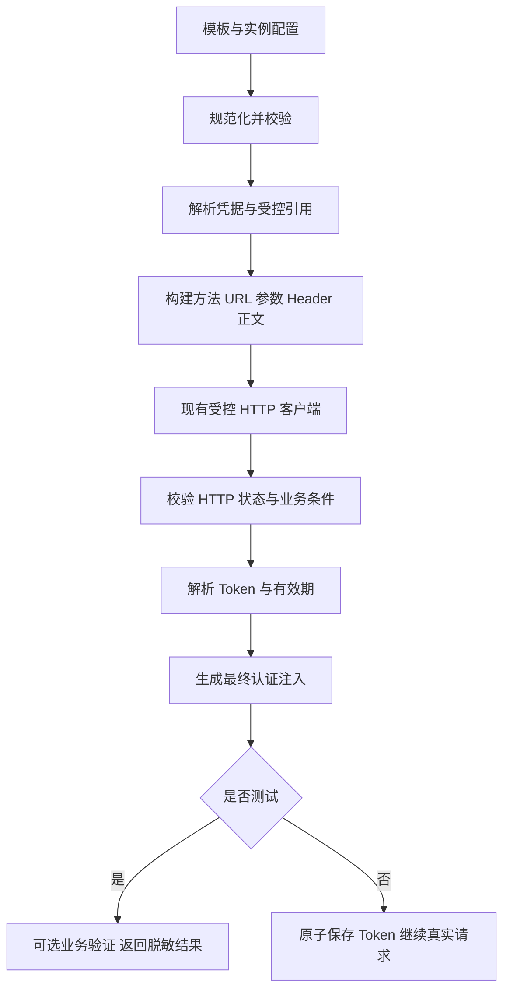

# 认证请求配置补齐开发文档

> 状态：主体开发完成，本地合同测试与浏览器验收通过；internal-ss 的真实 Windows 服务与业务接口验收仍需实际可达环境和有效测试凭据。
>
> 日期：2026-10-02。依据当前工作区的认证模板、认证实例、账号验证和执行代码编写。
>
> 目标：补齐常见登录接口的配置能力，同时让普通用户通过凭据字段、认证地址、Token 路径和明确的有效期规则完成接入。
>
> 本文是现有认证能力的补充，复用 [原生认证扩展方案](native-auth-development-plan.md) 中已经实现的标准认证流程，以及 [实例与账号简化方案](auth-instance-account-simplification-plan.md) 中的入口；不重做认证中心。

## 实施记录（2026-10-02）

### 已实现

- v2 请求配置和旧配置读取：GET 查询参数、POST JSON/普通表单、默认凭据传参、显式映射、固定标量、嵌套 JSON 对象、自定义 Header、实例密钥引用。
- 模板方法/格式完整读回，编辑和复制保留配置；模板保存及状态变更校验版本，发布前重新校验结构。
- 实例请求和注入规则覆盖；业务成功条件；秒、毫秒、Unix 时间戳、RFC3339、固定时长和无过期时间；新配置测试与运行使用相同解析规则。
- 自定义刷新令牌路径与刷新请求、轮换保存、失败保留旧凭据、明确失效条件下仅回退一次重新登录；继续复用原刷新锁和乐观并发。
- 未保存配置的真实测试与分步结果、可选业务验证、GET/POST 验证请求及业务成功条件；结构错误显示失败步骤，Token/有效期错误定位到输入；测试不创建账号，不写 Token 缓存，不改变账号状态。
- 模板简洁入口、默认折叠高级选项、实例继承摘要、敏感请求预览、凭据必填开关和基本类型；测试凭据不写浏览器存储，关闭或切换时清空，过期异步结果不会写回其他实例面板。
- 标准 OAuth/OIDC 等保留专用协议路径。旧有效期和旧 GET 语义保留在兼容路径中，升级提示重新测试，不在启动时批量修改用户配置。

实现复用现有存储列，没有新增数据库迁移；请求构建与响应解析集中在 `internal/authn/request.go`，业务验证及分步测试在 `internal/authn/verification.go`，避免为少量响应函数另外创建一套框架。

### 验证记录

| 检查 | 结果 |
| --- | --- |
| `scripts/check.sh` | Go vet、Go race 测试、前端格式/lint、52 项前端测试及构建通过 |
| 隔离 PostgreSQL/Redis 集成 | 认证、HTTP API、模板配置往返与版本、刷新轮换/失败/回退等通过 |
| 全量集成原有失败 | `TestIdempotencyCleanupPreservesUnknownAndActiveJobs` 在幂等清理模块继续失败；单独跳过该项后的其余全量 race 集成检查通过，没有修改该模块 |
| 8081 浏览器正例 | 临时上游服务：未保存实例配置分别用 POST JSON 和 GET 查询参数换 Token，提取有效期，再执行 POST 业务验证，四步骤全部通过 |
| 8081 浏览器反例 | Token 路径指向不存在字段时，认证请求通过，响应解析失败，业务验证未执行 |
| 测试隔离 | 前后实例数与账号数均为 1；用户原 Token 地址和实例配置未改变；Token 未回传页面，测试密码未进入 localStorage/sessionStorage |
| 页面尺寸 | 桌面 1280px；手机 390px、320px 无页面横向溢出；GET 选择后正文格式隐藏，高级设置默认折叠，控制台无新增异常 |

临时上游服务验证的是完整真实 HTTP 路径，不是用户 Windows 上的 internal-ss 服务。后者未在本轮使用用户凭据发送认证或业务请求，不宣称其端到端验收完成。

以下章节保留配置契约、兼容策略和验收标准，便于后续维护。

## 1. 范围和设计原则

本轮覆盖自定义静态凭据、自定义登录换 Token、既有标准 OAuth 流程的配置保留、认证实例测试和账号验证。管理台登录、任意脚本执行、通用工作流、多步骤验证码和 MFA 登录不在本轮范围内。

遵循以下规则：

1. 默认界面简单，复杂能力按需展开；不要求用户写 JSON 或表达式才能接入普通接口。
2. 模板描述通用规则，实例提供具体地址与必要覆盖，账号保存个人凭据。
3. 普通登录接口与标准 OAuth 分开。不能把“使用表单”直接解释成 OAuth 客户端凭据协议。
4. 结构检查、换取 Token、业务验证分别给出结果；任何一步未执行都不能显示通过。
5. 保存、编辑、复制、测试、真实请求共用同一份配置定义，禁止前端重新写默认值覆盖已有配置。
6. 测试与运行使用相同请求构建和响应解析；仅保存、缓存和账号状态更新有差异。
7. 保留现有受控出站客户端、密文存储、刷新锁和乐观并发检查，不另建一套认证执行系统。

## 2. 当前代码基线与确认的问题

| 位置 | 当前行为 | 本轮改动 |
| --- | --- | --- |
| `web/src/pages/auth-methods.tsx` | 自定义模板编辑器只有凭据字段与注入规则；实例只有 Token 地址、路径等 | 增加请求配置和折叠高级配置 |
| `web/src/demo.tsx` | 保存、复制模板固定写 `method: POST`；读回丢失方法和格式 | 完整读写规范化配置，复制保留语义 |
| `internal/httpapi/admin.go:saveAuthTemplate` | 校验模板标识、流程、状态和注入规则，未完整校验凭据与 Token 请求结构 | 统一配置校验，发布前再次校验 |
| `internal/authn/service.go:requestInstanceToken` | 读取模板方法；凭据按字段名直接进入 JSON/表单；GET 未转为查询参数 | 复用统一构建器，支持参数映射、固定值和请求头 |
| 同上 | `client_credentials` 分支生成标准 OAuth 表单 | 保留标准协议；新增普通表单登录配置，不改变旧流程语义 |
| 同上 | Token 必须是非空字符串；有效期主要按正整数秒解析；测试与运行校验不同 | 统一响应契约与有效期校验 |
| `internal/authn/service.go:Verify` | 验证请求固定 GET，仅判断 2xx；未配置路径时标为 configured | 支持可选验证请求及业务成功条件，保留状态区别 |
| `internal/authn/service.go:TestInstanceToken` | 换取 Token 并检查注入模板，不发业务验证请求 | 增加可选业务验证阶段，显式返回分步结果 |
| `internal/authn/config.go` | 校验地址、路径和协议相关配置 | 扩展为统一解析与校验入口 |
| `internal/store/auth.go` | 模板已有 JSONB 请求配置和版本；保存模板递增版本 | 复用存储，补充模板更新的期望版本检查 |
| `internal/jsonutil/path.go` | 支持受限字段路径与数组索引 | 复用路径读取；参数写入单独实现受限对象路径，不支持任意 JSONPath |

现有 Header、查询参数、Cookie 注入和真实换 Token 测试应继续复用。不能将“实例未提供请求方法覆盖”直接视为所有协议的缺陷：标准 OAuth 的方法受协议约束，不开放随意覆盖。

## 3. 页面交互

### 3.1 新建认证模板

主要区域固定为三个，桌面与手机使用同一套字段和行为。

#### A. 账号需要填写什么

每行包含字段标识、显示名称、敏感开关、必填开关和删除按钮。提供“添加字段”。

- 默认类型为字符串、必填；密码等字段默认敏感。
- 普通界面不增加类型、正则、默认值等栏目。
- 本轮可以把数字、布尔类型放进字段高级设置；不支持正则校验和复杂对象凭据。
- 敏感字段禁止配置明文默认值。
- 必填在前后端都检查；`false` 和 `0` 对对应类型是合法值，不能按字符串真假判断。
- 未填写的可选字段默认不发送；不自动发送空字符串。

#### B. 如何获取 Token

“凭据获取方式”使用清晰名称：

- 直接使用凭据：隐藏换 Token 请求配置。
- 登录接口换 Token：显示 GET / POST，以及 POST 的 JSON / 表单选项。
- OAuth2 客户端凭据：显示标准协议提示，沿用已有客户端认证配置，固定 POST 表单。

旧的“两步换取令牌”对应登录接口换 Token；旧的“表单换取令牌”对应既有 OAuth2 客户端凭据，不能自动迁移为普通表单登录。

登录接口默认 POST + JSON。默认提示“按凭据字段名称发送参数”，不用用户逐个添加映射。

折叠区“高级请求配置”包括：

1. 参数映射：请求参数名、值来源、目标位置。值来源可选凭据字段或固定值。
2. 自定义请求头：名称、值来源或固定值。
3. JSON 嵌套参数：参数名使用 `login.account` 形式，页面给出示例和实时错误。
4. 请求预览：用示例值展示方法、目标参数位置和正文结构；敏感内容显示 `***`。

不提供完整 URL 输入：真实地址属于认证实例。请求预览也不需要拼一个虚假的服务地址。

#### C. 如何携带 Token

登录换 Token 默认 `Authorization: Bearer {{token}}`。静态凭据按所选字段生成可编辑的规则。

用户可以选择请求头、查询参数或 Cookie；默认只有一条规则，按需添加。高级语法沿用受控占位符，不增加脚本编辑器。

模板内的规则为默认规则；实例只有显式开启覆盖后才替换。需要明确提示“替换模板注入规则”，避免相同 Header 被两个不同来源静默覆盖。

### 3.2 新建认证实例

默认展示：实例名称、适用系统、认证模板、认证地址、Token 字段路径、有效期和认证方式摘要。

- 摘要示例：`POST · JSON · Authorization Bearer`。
- Token 路径可输入 `data.token` 或 `$.data.token`，保存时统一规范化。
- 新登录接口的默认有效期是“读取字段”，字段为 `expires_in`，单位为秒。
- 用户可以明确选择“无过期时间”；字段缺失不能自动当成永久有效。
- 高级时间格式、响应成功条件、刷新请求和业务验证折叠展示。
- “覆盖模板请求配置”默认关闭。开启后展开方法、格式、参数和请求头；标准 OAuth 不显示不允许的覆盖项。
- 选择不同模板会影响字段与配置。已有输入不静默丢失：展示差异并允许取消切换；编辑已有实例时不迁移账号凭据。
- API 基础地址属于集成，认证地址属于实例；可以相同，也可以不同，页面不要混用。

实例覆盖采用“整个请求配置替换”，不在前后端做不同的逐字段深度合并。开启覆盖时先复制模板配置，再编辑；关闭时回到模板。响应、刷新和验证配置各自独立。

### 3.3 测试与结果

保留保存按钮，在旁边提供“测试”，可对未保存的输入执行。

点击后显示一个小面板：

- 先执行结构检查；结构错误定位到字段，不能继续发请求。
- 模板中的凭据字段生成测试输入；敏感值用密码输入框。
- 实例已配置业务验证且填写了测试用 API 基础地址时，可勾选“同时验证 API”，默认勾选。
- 没有业务验证配置时显示“未配置业务验证”，不默认绿色通过。
- 若存在多个关联集成，要求选择具体集成；若新实例尚无集成，使用当前新建表单中的 API 基础地址，不擅自选取其他系统地址。

结果依次展示：

```text
✓ 配置有效
✓ 已取得 Token
✓ Token 与有效期符合配置
✓ 业务验证通过
```

执行失败后展示对应步骤、可理解的原因和请求 ID。例如“Token 字段 data.token 不存在”“业务响应 code 为 401，要求为 0”。不输出完整上游响应。

标准 OAuth 授权码/OIDC 无法仅靠账号密码完成此测试：提示需要浏览器授权并跳转现有授权流程。静态凭据可做结构与业务验证，但没有“取得 Token”步骤。

测试完成后保留配置输入。测试凭据只保存在当前面板内存，关闭面板或切换实例清空；不写浏览器持久存储，也不写账号、Token 缓存或数据库。

### 3.4 状态与关闭行为

- 测试成功不自动保存实例，不自动创建账号，不更新已有账号验证状态。
- 保存成功后，关闭页面不再提示未保存；保存失败保留输入。
- 只保留一个未保存确认入口，避免重复弹窗。
- 账号验证状态继续区分 pending/configured/active/error；具体名称沿用当前后端状态实现。
- 没有业务验证时维持 configured/pending 的现有语义，不因为换到 Token 就默认标 active。
- 页面说明“配置有效”“已取得 Token”“账号已就绪”是不同结果。

## 4. 配置模型

### 4.1 存储分工

沿用现有列，不为每个新字段新增数据库列：

| 存储位置 | 内容 |
| --- | --- |
| `auth_templates.credential_schema` | 凭据字段定义 |
| `auth_templates.token_request` | 版本化默认请求配置 |
| `auth_templates.injection_rules` | 默认业务请求认证注入 |
| `auth_instances.token_url` / `refresh_url` | 实际 Token/刷新地址 |
| `auth_instances.token_path` / `expiry_path` | 既有 Token/有效期路径，继续作为唯一路径来源 |
| `auth_instances.public_config.authRequest` | 请求覆盖、响应条件、有效期格式、刷新规则、验证规则、注入覆盖 |
| 现有实例和账号密文 | 客户端密钥、账号密码、Token 等秘密 |

`public_config` 中的其他 OAuth、OIDC、mTLS、AWS 字段完整保留；保存新配置不能覆盖已有协议字段。顶层实例路径与新对象不重复存储，以免读到两个不同值。

### 4.2 模板请求配置示例

以下为已实现的 v2 配置契约；旧配置继续通过兼容解析器读取。

```json
{
  "schemaVersion": 2,
  "method": "POST",
  "bodyType": "json",
  "credentialMode": "all",
  "parameters": [],
  "headers": []
}
```

字段定义：

| 字段 | 取值与规则 |
| --- | --- |
| `schemaVersion` | 新配置固定 2；旧配置通过兼容解析器读取 |
| `method` | 普通登录只允许 GET、POST；标准 OAuth 固定 POST |
| `bodyType` | `none`、`json`、`form`；GET 必须 none |
| `credentialMode` | `all` 按凭据字段名发送；`mapped` 只发送显式参数，避免重复传送原始字段 |
| `parameters` | 参数数组，字段为 `name`、`target`、`value` |
| `headers` | Header 数组，字段为 `name`、`value` |
| `value` | 受限取值对象：凭据引用、实例秘密引用、固定 JSON 值；刷新/验证允许受控 Token 引用 |

值来源示例：

```json
{
  "schemaVersion": 2,
  "method": "POST",
  "bodyType": "json",
  "credentialMode": "mapped",
  "parameters": [
    {"name": "login.account", "target": "body", "value": {"source": "credential", "name": "username"}},
    {"name": "login.password", "target": "body", "value": {"source": "credential", "name": "password"}},
    {"name": "client", "target": "body", "value": {"source": "literal", "value": "connara"}}
  ],
  "headers": [
    {"name": "X-Tenant", "value": {"source": "literal", "value": "demo"}}
  ]
}
```

普通用户通过行编辑器生成配置，不接触上述 JSON。`literal` 支持字符串、数字、布尔值和 null；不支持动态代码。引用必须存在于声明的凭据/秘密集合，不能读取环境变量或其他账号。

`credentialMode: all` 要求 `parameters` 为空。用户首次开启参数映射时，页面把所有现有凭据转换为映射行，然后切为 mapped，避免忘记映射密码导致请求缺字段。Header 配置不受此开关影响。

实例秘密引用的 `source` 为 `instance_secret`，名称必须事先声明。高级配置中可创建“实例固定密钥”输入，值写入现有实例 `secrets` 密文；公开配置只保存引用。密码、API Key 等秘密不能借“固定值”存入公开 JSON。对来自敏感凭据、实例秘密和运行 Token 的派生值一并脱敏，不能仅根据字段名判断。

JSON 参数写入第一版只允许对象字段路径，不允许数组写入、通配符或函数。需要带点的字面字段名时支持单个受限方括号字段写法，前后端使用同一契约。表单和查询参数中的名字视为字面名称，不按点号拆分。路径冲突如 `login` 与 `login.account` 在保存时拒绝。

### 4.3 实例配置示例

```json
{
  "authRequest": {
    "schemaVersion": 2,
    "requestOverride": null,
    "injectionOverride": null,
    "response": {
      "successCondition": {"path": "$.code", "operator": "equals", "value": 0},
      "expiry": {"mode": "field", "format": "duration_seconds"}
    },
    "refresh": {
      "mode": "relogin"
    },
    "verification": {
      "enabled": true,
      "request": {
        "schemaVersion": 2,
        "method": "GET",
        "bodyType": "none",
        "credentialMode": "mapped",
        "parameters": [],
        "headers": []
      },
      "successCondition": {"path": "$.code", "operator": "equals", "value": 0}
    }
  },
  "verificationPath": "/me"
}
```

- `requestOverride: null` 继承模板；非 null 为完整替换。
- `injectionOverride: null` 继承模板注入；非 null 为完整规则数组。既有实例 Header 字段通过兼容转换进入最终规则，不能重复注入。
- `successCondition` 默认不设置，表示只检查 HTTP 2xx 和必要响应字段。页面提供“字段等于值”，只支持类型严格相等，不隐式把字符串 `"0"` 转成数字 0。
- 过期时间路径继续存于 `expiryPath`，Token 路径继续存于 `tokenPath`。
- 业务验证路径继续使用 `verificationPath`，沿用既有执行器以 `/` 开头的安全路径解析规则：`/me` 定位到目标来源的 `/me`，不自动附加基础地址的目录前缀。
- 验证未开启时禁止返回业务验证成功；开启后必须具有路径和明确的 API 基础地址。

### 4.4 有效期契约

支持以下显式模式：

| 模式/格式 | 语义 |
| --- | --- |
| `field` + `duration_seconds` | 剩余秒数，正整数 |
| `field` + `duration_milliseconds` | 剩余毫秒数，正整数 |
| `field` + `unix_seconds` | Unix 秒时间戳 |
| `field` + `unix_milliseconds` | Unix 毫秒时间戳 |
| `field` + `rfc3339` | 带时区的日期时间字符串 |
| `fixed` + `seconds` | 用户明确提供固定有效秒数 |
| `none` | 用户确认 Token 无到期时间；不自动猜测 |

限制：禁止负数、溢出和已经过期的绝对时间。整数格式可以接受 JSON 整数或仅含十进制数字的字符串，不接受浮点小数与科学计数法字符串。格式选择必须确定，不根据数值长度猜秒或毫秒。

配置了 field 却缺少或格式错误时，测试和运行均失败，不保存新 Token。显式 none 才允许无到期时间。复用当前提前刷新窗口，并避免短有效期导致无限重取；测试覆盖短有效期边界。

### 4.5 刷新契约

普通登录支持：

- `relogin`：到期后使用原凭据重新登录，默认。
- `refresh_token`：读取指定 refresh token 路径，使用 `refreshUrl` 与独立请求配置刷新。

刷新所需的 token 使用受控 `runtime` 引用，只允许 `token`、`access_token`、`refresh_token`。首轮登录配置不允许引用尚未取得的 Token。刷新响应继续使用同一 Token/有效期规则；refresh token 未轮换时保留旧值，轮换时原子更新。

自定义刷新失败默认报告失败；只有显式启用“刷新凭据失效时重新登录”才对明确的凭据失效结果执行一次回退。超时、连接中断和未知服务错误不能无限回退或重试。

标准 OAuth/OIDC 继续使用现有协议刷新逻辑，不允许普通参数覆盖破坏 grant_type、客户端认证或 PKCE。标准协议中的有效期和 refresh token 规则保持既有契约。

普通刷新配置形状为：

```json
{
  "mode": "refresh_token",
  "refreshTokenPath": "$.data.refresh_token",
  "fallbackOnInvalidRefreshToken": false,
  "request": {
    "schemaVersion": 2,
    "method": "POST",
    "bodyType": "form",
    "credentialMode": "mapped",
    "parameters": [
      {"name": "refresh_token", "target": "body", "value": {"source": "runtime", "name": "refresh_token"}}
    ],
    "headers": []
  }
}
```

开启 refresh_token 时，首次登录必须按 refreshTokenPath 取得非空字符串，并具有 refreshUrl；不能到第一次过期后才发现缺配置。凭据失效回退必须有明确判定：标准协议沿用 invalid_grant；自定义接口通过单独的 `invalidRefreshCondition`（字段等于值）定义。未定义判定时不允许打开回退。该条件仅用于失败分类，不能把失败响应当作登录成功。

## 5. 请求构建与响应处理

### 5.1 统一执行顺序



`internal/authn` 内增加小型请求构建、响应解析函数；不新增通用脚本引擎或第二套 HTTP 执行框架。协议流程负责产生协议专用参数，普通登录流程使用通用配置。共用客户端、上限和错误处理。

### 5.2 请求规则

- GET 凭据默认进入查询参数，正文为空；POST 默认进入所选正文，允许高级配置把部分参数放入查询参数。
- 查询参数使用 URL 编码；JSON 使用序列化器；表单使用表单编码。禁止通过字符串替换直接拼 JSON。
- 保留实例地址中既有查询参数；配置参数同名冲突在检查时拒绝，不静默覆盖。
- 请求头名称、值拒绝换行；拒绝由普通配置指定 Host、Content-Length、Connection、Transfer-Encoding 等传输控制字段。
- Content-Type 由格式决定，普通配置不能提供冲突值。
- 首轮登录的 Authorization 可配置以适配上游；协议内置认证 Header 与自定义 Header 冲突时拒绝。
- 账号原始密码只在登录请求中按配置发送。业务验证请求禁止直接引用原始密码字段，使用最终认证注入与必要非秘密参数。
- 最终业务认证注入只能有一个确定来源；同位置、同名规则在配置校验时拒绝。

### 5.3 响应规则

- 所有认证请求先检查 HTTP 2xx，再检查可选业务成功条件。
- 登录响应必须是 JSON，按配置读取非空字符串 Token。
- 业务验证没有业务条件时可接受非 JSON 的 2xx；设置 JSON 字段条件后必须返回可解析 JSON。
- Token 获取成功但业务验证失败，测试返回失败步骤，不能显示全部通过。
- 登录、刷新均复用当前响应大小限制；业务验证也限制读取量，不能把大正文回传浏览器。
- Token 路径、有效期路径和业务条件使用现有受限路径读取工具，不引入完整 JSONPath。

### 5.4 模板变量与命名

执行时明确建立 `token` 和 `access_token` 运行值；新登录模板统一生成 `{{token}}`。原始凭据字段与运行字段冲突时，新模板保存拒绝，避免密码或自填 Token 覆盖系统值。

旧模板若存在 `{{api_token}}` 等不同变量，迁移前检查实际凭据和引用：不能简单全局替换，因为该变量可能是合法静态凭据字段。只有明确属于“换取 Token 后注入”的旧默认规则才能兼容映射；其余给出定点修复提示并保留原数据。

## 6. API 契约

### 6.1 模板与实例保存

复用现有接口：

- `POST /api/auth-templates`
- `PATCH /api/auth-templates/{id}`
- `POST /api/auth-templates/{id}/status`
- `POST /api/auth-instances`
- `PATCH /api/auth-instances/{id}`

增加模板 `version` 更新前置条件，和实例现有版本处理一致。编辑已有资源必须携带读取版本；并发冲突返回 409。创建不携带版本。

模板保存校验凭据结构、方法、格式、引用、路径冲突、注入规则。草稿允许未填写实例地址，但不能保存非法配置结构。发布时执行同样校验，不能绕过保存接口。

实例保存 ready 状态必须具有完整有效配置；草稿可缺少必要值，但拒绝非法枚举、错误类型和无效语法。接口将缺少项和非法项区分，前端据此提示。

### 6.2 当前输入检查与真实测试

复用：

- `POST /api/auth-instances/check`
- `POST /api/auth-instances/{id}/check`

仍以实例保存字段作为基础；扩展：

```json
{
  "instanceKey": "internal-ss",
  "name": "内部系统",
  "systemId": "<system-id>",
  "authTemplateId": "<template-id>",
  "tokenUrl": "http://<reachable-host>:18001/api-hub/getToken",
  "tokenPath": "$.data.token",
  "expiryPath": "$.data.expires_in",
  "publicConfig": {},
  "authenticate": true,
  "testCredentials": {"username": "test-user", "password": "<test-secret>"},
  "verifyApi": true,
  "testTarget": {"integrationId": "<integration-id>"}
}
```

新实例没有集成时，`testTarget` 可改为 `{"baseUrl":"https://api.example.com"}`，二者互斥。已存在集成必须属于当前工作区、系统及允许的实例关联，不能通过 ID 测试别人的账号或集成。当前未保存的配置覆盖此次执行，不隐式读取其他实例配置。

测试返回示例：

```json
{
  "configured": true,
  "authenticated": true,
  "apiVerified": false,
  "steps": [
    {"name": "configuration", "status": "passed"},
    {"name": "token_request", "status": "passed", "httpStatus": 200},
    {"name": "token_response", "status": "passed"},
    {"name": "api_verification", "status": "failed", "code": "verification_condition_failed"}
  ],
  "effectiveConfig": {"method": "POST", "bodyType": "json", "tokenPath": "$.data.token"},
  "error": {"code": "verification_condition_failed", "message": "业务验证结果不符合成功条件", "field": "publicConfig.authRequest.verification.successCondition"}
}
```

成功返回 200；结构/凭据非法返回 400，资源或版本冲突返回 409，上游执行失败返回 502，超时返回 504。错误响应沿用现有统一错误包络，将 `steps` 等放入约定的详细结果字段；不能让示例对象覆盖当前 `code/message/requestId` 的客户端解析契约。前后端在实施时定义同一个错误结果类型。

步骤状态只允许 passed/failed/skipped；失败之后未执行的步骤为 skipped。`configured`、`authenticated`、`apiVerified` 按实际阶段计算，不直接沿用请求开关。

现有 `POST /api/auth-instances/{id}/test` 保留原结构检查语义，页面逐步统一使用 check；本轮不删除旧接口，也不让它突然发真实认证请求。

### 6.3 账号验证

账号验证沿用当前 `/api/connections/{id}/verify`，复用统一请求/响应契约。成功且配置了业务验证才标记 active；未配置则只标 configured。失败保留可编辑与重试入口，不自动添加重复账号。

## 7. 校验、权限与出站边界

- 所有保存、测试和验证沿用现有管理权限、工作区隔离、请求 ID 和审计机制。
- 审计记录配置变更及测试结果，不保存测试凭据、Token、完整请求正文或敏感 Header。
- 引用错误、重复参数、未知版本、未知字段、非法请求方法、配置太大等在发出上游请求前拒绝。
- 限制参数、Header、凭据和注入规则数量及字符串长度；具体常量集中定义，建议每种请求最多 64 参数、32 Header，注入规则沿用当前最多 16 条。
- 复用现有 40 秒认证操作总超时，分步骤剩余时间传递；不为每步重新获得完整 40 秒。主动重试只沿用已明确的协议机制。
- 配置过的认证地址通过现有 `ConfiguredEndpointClient` 授权访问对应来源，不要求用户为每个认证地址添加 env。
- 新的测试业务地址/已选集成来源需要在此次认证验证中明确加入同样的来源授权；只允许本次目标来源，不将其加入全局白名单。
- 保留来源精确匹配、端口与协议边界、跨来源重定向限制和受控解析拨号。本文不将任意业务执行地址自动全局放行。
- 错误详情中的 URL 隐去查询凭据和 userinfo；不得把上游原始错误直接返回用户。保留“连接拒绝”“超时”“字段不存在”等诊断信息。
- WSL/Windows 可达性属于运行环境：`127.0.0.1` 指后端所在环境，页面不能自动替换为某个 Windows 网关 IP。

## 8. 兼容与迁移

### 8.1 旧配置读取

解析器区分旧配置和 schemaVersion 2；禁止猜测未知版本。

| 旧行为 | 兼容策略 |
| --- | --- |
| 缺少 method | 按当前规则 POST |
| 缺少 bodyType | 普通旧密码登录沿用 JSON |
| 旧 client_credentials | 保留 OAuth POST 表单和客户端认证，不转换普通表单登录 |
| 旧 verificationPath | 转换为 GET 验证，未设置业务成功条件 |
| 旧实例 Header 与模板注入 | 保持当前最终覆盖顺序，转换为一个确定的有效规则集合；升级编辑器明确展示冲突来源 |
| 有效期缺失时旧普通流程无 expiry | 通过兼容配置保留旧行为，并标注“旧配置：未明确有效期”；新配置不沿用模糊默认 |
| 旧高级 Token 请求字段 | 先识别当前实际支持项；无法表达或未知项阻止静默重写，提示修复，保留原始数据 |

保留旧有效期语义只限 schemaVersion 1 的兼容路径；升级到 v2 要求用户选择明确的有效期规则。v2 不保留测试和运行的校验差异。

旧 GET 配置若存在，应提示旧实现曾将参数放在正文，不能无提示自动改变生产请求。列出受影响实例，升级确认时明确采用查询参数语义。

### 8.2 迁移执行

第一阶段使用读取兼容，不批量修改用户数据，不在服务启动时自动发认证请求。用户编辑并保存后写入 v2；迁移前可用只读检查统计受影响配置。

如果需要持久化兼容标记或新增数据库约束，使用 `internal/store/migrations` 的下一个可用序号，不能覆盖已有 `005_auth_extensions.sql`。当前 JSONB 列足以承载主体配置，不为了本轮制造无必要的列。

### 8.3 模板更新影响

继承模板的实例会受到模板请求配置更新影响，因此保存前展示关联实例数量和配置差异。期望版本只防并发覆盖，不能代表版本快照。

本轮明确沿用“实例引用模板当前配置”的现有机制，不引入发布快照系统。需要保持某实例请求稳定时，用户开启实例覆盖。模板保存后关联账号不自动标 active，也不自动批量重取 Token；页面提示重新测试/验证。已有缓存 Token 按现有生命周期继续使用，下一次换取使用新的有效配置。

## 9. 文件实施落点

| 文件/模块 | 任务 |
| --- | --- |
| `internal/authn/config.go` | v1/v2 解析、有效配置计算、结构/引用/协议校验 |
| `internal/authn/request.go`（新增） | GET/POST 构建、编码、参数映射、受限路径写入 |
| `internal/authn/request.go` 中的响应函数 | 业务成功条件、Token、refresh token、有效期解析 |
| `internal/authn/service.go` | 登录、刷新、测试、账号验证调用统一组件；保留缓存与锁 |
| `internal/authn/oauth_client.go` / `oidc.go` | 只接入必要共用能力，保留协议专用约束 |
| `internal/httpapi/admin.go` | 保存/发布校验、分步测试响应、测试目标检查、版本冲突 |
| `internal/store/auth.go` | 模板更新版本前置条件、配置完整读回 |
| `internal/model/model.go` | 必要的共享 API 数据结构；不添加未使用的领域抽象 |
| `web/src/types.ts` / `api.ts` | 配置与测试结果类型、错误定位 |
| `web/src/demo.tsx` | 完整读写、复制保留、兼容转换、不再写死 POST |
| `web/src/pages/auth-methods.tsx` | 简单表单、高级展开、覆盖配置、测试步骤 |
| `web/src/pages/connections.tsx` | 字段校验、验证结果与重试、保持输入 |
| `web/src/pages/core-shared.tsx` | 凭据字段与默认变量规范同步 |
| `web/src/locales/en.json` | 新增文案同步，GET/POST 等技术标识保持原样 |

只有在模板与实例确实共享相同交互时才提取小型组件；不因页面较长就重写整个认证中心。

## 10. 开发批次与完成条件

### A. 配置契约与兼容基础

完成 v2 类型、v1 兼容解析、有效配置计算、结构与引用校验、模板期望版本和读写保留。

完成条件：旧 POST 配置行为不变；编辑、复制无配置丢失；非法配置在保存/发布/测试入口一致拒绝。此批次不宣称 GET 可用。

### B. 普通登录请求与简洁页面

实现 GET 查询参数、POST JSON/表单、默认凭据映射、固定参数、嵌套对象和请求头。补齐模板与实例摘要/覆盖界面。

完成条件：以可控上游测试服务断言最终方法、URL、Header 和正文；普通表单登录与 OAuth 客户端凭据互不混淆。

### C. 响应与刷新

实现业务成功条件、显式有效期、自定义刷新与运行校验统一，修复运行变量引用。

完成条件：错误格式在测试和运行都失败；失败不覆盖已有凭据；刷新轮换原子保存，刷新锁继续有效，无重复无限请求。

### D. 分步测试与账号验证

实现未保存配置真实测试、可选业务验证、业务验证 GET/POST、脱敏结果和输入保留。

完成条件：测试没有数据库/缓存副作用；换 Token 通过但业务验证失败时准确显示；静态与浏览器授权流程没有错误步骤标签。

### E. 浏览器回归、文档与真实接口验收

检查桌面和手机、编辑/复制、账号重试、国际化；构建嵌入资源后检查当前 8081 服务。使用实际可达的测试认证服务执行最终验收。

完成条件：本地测试与浏览器通过；真实服务的请求格式和响应契约经实际验证。不能用本地模拟通过替代真实接口验收。

批次可以分 PR，但未完成的选项不先展示为可用。第一批可交付 A+B，默认流程无需等所有高级能力才能使用。

## 11. 测试与验收清单

### 11.1 后端测试

| 场景 | 断言 |
| --- | --- |
| POST JSON 默认登录 | 凭据按名发送，敏感值未出现在查询参数和日志 |
| POST 普通表单 | 表单正确编码，不自动加入 OAuth grant_type |
| GET 登录 | 参数进入 URL，正文为空，空格/中文/特殊字符编码正确 |
| 参数映射 | 嵌套对象与固定值正确；mapped 不额外发送原始凭据 |
| 参数冲突 | 重复名、URL 查询冲突、对象路径冲突被拒绝 |
| Header | 自定义 Header 生效；换行/传输控制字段/冲突被拒绝 |
| 业务成功条件 | HTTP 200 + 错误 code 失败；类型不一致不误通过 |
| Token | 空串、空白串、缺失、数字、数组均失败 |
| 有效期 | 秒、毫秒、时间戳、RFC3339、fixed、none 正反例；溢出和已过期失败 |
| 测试与运行一致性 | 同一响应和配置在两个路径得到相同解析结论 |
| 刷新 | relogin、refresh_token 轮换、失败保留旧值、一次显式回退、锁与版本冲突 |
| 业务验证 | GET/POST 编码和注入一致；失败不标 active，未配置只标 configured |
| 测试副作用 | 成功/失败均不写账号、Token、缓存、验证状态或测试秘密 |
| 协议回归 | OAuth/OIDC/mTLS 等内置流程仍使用原协议约束 |
| 出站边界 | 配置来源可访问；跨来源重定向和未授权地址仍受限制 |
| 保存与复制 | 所有受支持字段往返保留，版本冲突返回 409，旧配置语义保留 |

### 11.2 前端与浏览器

- 新建普通 POST 登录：只填写字段、地址、Token 路径和有效期即可测试。
- 切换 GET：正文选项隐藏，预览显示查询参数；切回 POST 恢复合法配置，不发送残留正文。
- 高级设置默认折叠，修改后摘要能说明实际配置；隐藏状态仍生效的配置必须有提示。
- 切换模板、开启/关闭覆盖、编辑、复制、取消和失败重试均不丢输入或配置。
- 测试步骤未执行时显示 skipped；成功/失败图标与文案一致。
- 密码、Token、请求预览和错误响应均不泄露秘密。
- 账号已保存但验证失败：可打开原账号重试，不引导重复创建；关闭没有重复确认。
- 桌面 1280px 和手机 390px、320px 不横向溢出；键盘可操作折叠区、字段和按钮；检查焦点及屏幕阅读标签。
- 中英文文案同步，控制台无新增错误。

建议执行现有前端测试、构建、针对性 Go 测试和必要 PostgreSQL/Redis 集成检查。先确认当前工具与数据库依赖，不能把跳过集成测试当成通过。

8081 的页面资源由 Go 二进制嵌入：前端构建后必须重建并重启对应服务才验证到新页面。重启前确认监听进程、工作目录和启动配置，只操作本项目目标服务，保留其他 WSL 服务与进程。

### 11.3 internal-ss 验收示例

以实际接口合同为准，不猜用户名字段与返回结构：

1. 确认后端环境可连接 Windows 的 18001 服务，认证地址使用从该环境可达的主机地址。
2. 模板选择登录接口换 Token、POST、JSON；按实际接口定义凭据字段。
3. 实例填写 `/api-hub/getToken` 完整地址及真实 Token/有效期路径；若接口有业务码，配置成功条件。
4. 测试记录实际方法、脱敏参数结构、HTTP 状态、路径解析结果；测试账号数量和版本保持不变。
5. 使用同一配置添加或更新账号；调用实际业务验证接口成功后账号才变为可执行。
6. 在 API 操作中复用此账号执行查询；确认最终认证 Header/参数被上游接受。
7. 在受控测试环境模拟 Token 到期，验证重新登录或刷新；不对用户生产账号强制修改到期时间。

## 12. 本轮交付物

- 后端：版本化配置、统一构建/解析、完整结构校验、普通 GET/POST 登录、明确响应与刷新规则、分步测试和业务验证。
- 前端：三段式简单模板表单、实例继承摘要、按需覆盖、高级设置折叠、脱敏请求预览和测试面板。
- 兼容：旧协议与旧配置读取、完整编辑/复制、版本冲突处理、明确的升级提示。
- 验证：请求格式合同测试、状态与副作用测试、桌面/手机浏览器记录、真实接口结果。
- 文档：用户配置示例、错误排查和旧配置升级说明；持续更新本文件状态与验收记录。

未完成真实接口验证前，只记录本地已完成项，不把计划中的功能标为已支持。
