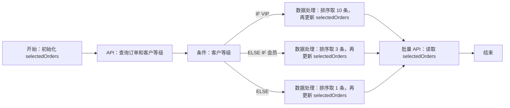

# 工作流六类节点：执行契约、UI 与场景验收

> 2026-10-03 交互优化：交互优化已接入：属性默认收起，单击只选中，双击或配置按钮打开；普通节点和条件出口就近添加，连线原子插入，结束前明确选择末端；新增/复制避让并将结束节点后移。依赖与删除操作收进次级区，删除前检查映射、条件出口与状态引用。节点 ID 放在高级操作区。 实测边界与截图见 [验收记录](workflow-validation-report.md)。

> 2026-10-03 开发记录：节点模型、条件/结束汇合、原子变量、只读运行时间与业务日期已接入；实现文件与验证证据见 [工作流开发验收记录](workflow-validation-report.md)，部署与调度恢复见 [运行维护说明](workflow-code-runtime.md)。仅将实际完成的本地检查记为通过；真实供应商及现有服务发布不在本次记录中冒充完成。

日期：2026-10-03。状态：首版已实现；本地验证与发布边界见开发验收记录。

本文是[可视化编辑与运行追踪开发文档](workflow-visual-editor-development-plan.md)的节点专项规格。总文档负责页面、保存、权限、运行追踪和交付阶段；本文负责节点配置、输入输出、分支语义、UI 和场景验收。已有 API 编排基线见[原工作流实现方案](workflow-orchestration-plan.md)。新增节点契约以本文为准，总文档的体验与安全约束继续适用。

流程变量补充：开始节点声明本次运行的可变值，API/数据处理/代码完成后或条件命中后显式赋值，后续节点读取最新有效值。具体契约、加工范围与 UI 见[流程变量](#flow-variables)，实现与验证结果见开发验收记录。

代码节点补充：新增仅支持 JavaScript 的第六类节点，负责多个来源共同计算、关联和结构转换；输入输出、受限执行、详细 UI、开发阶段与验收见[代码节点开发流程](workflow-code-node-development-plan.md)。

实施审阅补充：共用 nullable、失败分类及本地节点身份规则见第 2.5–2.7 节；代码支持命名输入样本和上游映射样本两种验证范围。v2 部署至少含一个 API，草稿/单节点样本不受此条件限制；事务、共享执行器、部署和审计细则见代码专项。

衔接规则补充：条件节点可承接公共汇合，结束仍等待全部有效步骤；新增固定到运行快照的只读时间来源，见第 2.8 节。正式执行与预览的容量分配、能力开关关闭及恢复后的定时行为见代码专项，不增加节点类型。

## 1. 节点范围与已有能力

产品只提供 **开始、API、数据处理、代码、条件判断、结束** 六类节点，用于确定性的多 API 调用与条件组合。条件判断直接支持 **IF → 多个 ELSE IF → ELSE**。代码仅支持受限 JavaScript 本地计算；不增加 LLM、Python、工作流循环、并行、等待、独立合并节点或独立计数节点。

| 节点 | 作用 | 主要输入 | 业务输出 | 是否计入步骤限额 |
| --- | --- | --- | --- | --- |
| 开始 | 声明输入与流程变量，设置默认值和触发方式 | 本次输入或整个默认输入对象、变量初始来源 | 只读 `trigger`，初始化可变 `vars` | 否，唯一虚拟节点 |
| API | 用明确集成/账号调用 API，可将结果写入变量 | 目标绑定、参数来源、失败策略、可选赋值 | API 原始解析响应，可为对象、数组、标量或 null | 是 |
| 数据处理 | 选择字段、改名、筛选、排序、截取、计数，可赋值 | 数据来源、有序操作列表、可选赋值 | `{ "result": ... }` | 是 |
| 代码 | 多来源计算、数组关联、结构转换，可赋值 | 命名输入映射及 Schema、JavaScript、返回 Schema、可选赋值 | main 返回的命名字段对象，不自动包装 result | 是 |
| 条件判断 | 按顺序选分支，可设置该分支的变量值 | 分支列表、比较条件、每个分支可选赋值 | `{ "branchId": "稳定分支ID" }` | 是 |
| 结束 | 组织工作流最终返回对象 | 输出字段及其来源 | 调用方获得的 JSON 对象 | 否，唯一虚拟节点 |

API、数据处理、代码、条件判断合计最多 20 个执行步骤；开始和结束不占用此限额，布局仍最多 22 个节点。一个条件节点内部的分支不另算节点。仍按稳定拓扑次序串行执行，不因画布出现分叉就并行调用。

v2 可部署流程至少包含一个 API 节点；没有 API 的草稿仍可保存和单节点样本执行，但不能部署、定时入队或通过 runtime 发现/调用。此规则不要求每条业务分支都调用 API，不增加纯计算公共接口。

目前源码只有 API 步骤、`dependsOn`、API `runIf`、模板映射和最终 `output`。数据处理、代码、独立条件、分支作用域、按分支取值、开始输入 Schema、可变流程变量和以下 UI 均需开发。现有开始输入与各步骤输出分别保存，同名字段不会自动覆盖。

<a id="shared-contract"></a>
## 2. 共用数据契约与字段选择

### 2.1 参数来源

API 参数、数据处理的数据来源、代码的命名输入和结束字段共用一个来源选择器：

| 来源 | UI | 保存与执行 |
| --- | --- | --- |
| 固定值 | 对应类型的输入框或字段 JSON | 保留原始 JSON 类型 |
| 开始输入 | 开始 → 字段 | `{{trigger.customerId}}` |
| 运行信息 | 运行信息 → 触发时间 / 计划时间 / 时区 / 业务日期 | v2 `$value.kind=run`，读取本次快照的只读字段，见第 2.8 节 |
| 流程变量 | 流程变量 → 字段，显示类型及最近可能的写入节点 | `{{vars.orderId}}`；读取本节点进入时的值，受读写依赖校验 |
| 上游结果 | 节点 → 字段，也可选择整个结果 | `{{get_customer.id}}`、`{{clean_orders.result}}` |
| 按分支选择 | 条件节点 → 每个出口对应的值 | 只解析本次命中分支的来源，见下文 |
| 组合文本 | 高级模板 | 沿用标量插值；不提供表达式语言 |

整值引用保持对象、数组、数字和布尔类型。API 响应没有 `data` 时，不生成虚构的 `data` 层。直接把 API1 的字段交给 API2，无需插入数据处理节点。

按分支取值是输入映射能力，不是一种额外节点。v2 定义使用明确的值标记：

```json
{
  "$value": {
    "kind": "branch",
    "conditionId": "route_stock",
    "cases": {
      "available": "{{place_order.id}}",
      "otherwise": "{{register_shortage.id}}"
    }
  }
}
```

- `conditionId` 必须指向已完成的上游条件节点；`cases` 用稳定分支 ID，不用名称或数组下标。部署时覆盖所有在该使用位置可能命中的分支，允许某个分支直接填写固定值。
- 运行时先读取 `route_stock.branchId`，仅解析对应值。未命中分支可以没有运行结果；命中分支的必需字段缺失仍报错。
- 不使用“取第一个非空值”。`0`、`false`、`null`、`[]` 都可能是合法业务值。
- 仅精确的单键 `$value` 对象作为 v2 保留标记，未知 kind 报错。确实要传同形业务对象时使用 `{"$value":{"kind":"literal","value":...}}`，其 value 按字面值保留、不递归解析。v1 普通对象语义保持不变。
- 分支值可以嵌套，供嵌套条件汇合使用；受定义大小和 JSON 深度限制，不扩展为任意表达式。结束字段可使用已有整值可选引用；API 参数不能用“允许缺失”掩盖必需输入错误。

### 2.2 API2 选择 API1 字段的 UI

```text
创建订单 / 输入参数

customerId *  string
[上游结果 ▾] [查询客户 → 客户编号 (id) ▾]

点开字段选择：
[搜索字段名或说明________________]
查询客户                      上游 API
  id       客户编号   string   示例 C100
  name     客户姓名   string
  orders   订单列表   array
    [使用整个列表] [选择某一项…]

提示：本次运行使用查询客户的实际返回值。
```

字段树优先使用 API `outputSchema`，其次使用用户主动粘贴的 JSON 样本并标记“样本推断”。Schema 和样本不一致时显示差异，不用样本覆盖声明。没有两者时保留手工路径入口；不能凭空保证字段存在，也不能为了补字段列表自动调用 API。

从 API1 的 + 添加 API2 后，优先展开 API1 的字段。点选立即形成显示业务名称、路径和类型的来源标签；标签可定位源节点，保存的是稳定引用，示例值不会写入参数。数据处理的字段树根据操作推导，代码根据返回 Schema 展示字段，条件节点可提供 branchId；类型不确定时显示未知，不伪造精确 Schema。

只推荐依赖闭包内、当前分支可用的来源。跨互斥分支的字段在普通来源列表中禁用，并提供“按分支选择”入口。数组明确选择“整个列表”或具体索引，不自动取第一项，不隐式逐条调用 API。字段名含点号等情况继续使用现有路径解析器支持的转义形式。

### 2.3 共用过程与预览

整次运行先在事务外检查身份及所需代码环境，未通过不调用业务 API。节点执行依次为：检查分支是否激活 → 检查激活节点的运行身份 → 固定本节点读取的变量版本 → 兼容旧 API runIf（若有）→ 解析输入 → 类型校验 → 执行 → 计算并校验赋值 → 一次发布成功输出与全部变量变更 → 记录状态。未激活分支不解析参数、不调用 API、不执行赋值；失败及身份规则见第 2.6–2.7 节。

状态通过 `status.<stepId>` 等独立运行上下文访问，不包装进 API 返回体。数据处理和条件判断复用同一套受限比较器及变量解析规则，预览和正式运行调用同一 Go 函数。

预览始终使用明确样本：API 只构建请求；数据处理返回样本处理结果；代码在与正式运行相同的受限进程执行样本；条件判断显示命中出口及判断过程。样本状态和成功输出需一致，不能一边标为 skipped 一边提供可引用的成功结果。预览不发送 provider 请求、不创建运行、不保存样本到布局或工作流快照；总文档的权限、脱敏、大小限制及缓存失效规则继续适用。

以上分支/来源/赋值预览属于 previewMode=workflow。代码另有 code_inputs 模式，只用命名 sampleInput 验证 main 和返回 Schema，不解析工作流来源、不判断激活状态、不预览 assign；UI 明确“仅验证代码计算”。具体请求和响应见[代码样本协议](workflow-code-node-development-plan.md#preview)，不能把代码单测结果当作整条流程预览成功。

<a id="flow-variables"></a>
### 2.4 流程变量：声明、加工、赋值与后续使用

#### 2.4.1 生命周期与声明

`trigger` 保存本次调用的原始输入，`vars` 保存可更新的运行变量，各 API/数据处理/代码输出仍按步骤 ID 独立保存。它们是不同来源：声明同名 orderId 不会自动改写 trigger，也不会回写 workflow.input。每次运行重新初始化，运行之间互不共享；结束节点只返回显式配置的字段，不自动暴露全部变量。

开始节点管理 `graph.variables`，每个变量包含稳定名称 name、JSON type、说明 description、nullable（默认 false）及必填 initial。首版最多 32 个变量，支持 string/number/integer/boolean/object/array；类型固定，不能在一条分支写数字、另一条分支写字符串。对象/数组首版校验顶层类型，内部字段类型未知时仍需运行时检查。

initial 只允许固定值、开始输入引用或第 2.8 节的运行信息来源，不引用 API、分支或其他变量，避免初始化依赖。先确定本次 trigger 和只读运行信息，再解析并校验 initial；输入或初始化失败时不执行任何 API。使用开始默认 orderId 时，声明如下，不重复维护两份默认值：

```json
{
  "variables": [
    { "name": "orderId", "type": "string", "initial": "{{trigger.orderId}}" },
    { "name": "orderLabel", "type": "string", "initial": "待处理" },
    { "name": "selectedOrders", "type": "array", "initial": [] }
  ]
}
```

这是 graph 的配置片段；`workflow.input` 可设为 `{ "orderId": "O001" }`。若需要在后续才产生一个 string 值，可声明 nullable=true、initial=null；引用缺失的 trigger 路径会报错，不自动变成 null。0、false、空字符串和空数组均按真实值保留。

变量名采用 1–64 位 ASCII 字母/数字/下划线，首位为字母；界面说明可中文。改名需结构化更新所有 vars 引用和赋值目标，列出影响并原子应用。声明和赋值计入 256 KiB 定义限额；运行变量当前值计入现有 8 MiB 运行数据总预算，单值最多 4 MiB；新旧值替换按实际保留数据计数，不因多次覆盖永久累计旧值，超限拒绝赋值而非截断。

#### 2.4.2 在已有节点上配置“更新流程变量”

| 位置 | 配置 | 生效时机 |
| --- | --- | --- |
| API 节点 | `assign: [{variable, value}]` | API 调用及响应规则成功后，用本次响应赋值 |
| 数据处理节点 | 同一 assign 配置 | 全部处理操作成功后，用 result 或其他合法来源赋值 |
| 代码节点 | 同一 assign 配置 | main 返回且输出检查成功后，用返回字段或其他合法来源赋值 |
| 条件节点各出口 | `branches[].assign` | 条件首次命中后、该出口后续执行前，仅执行命中分支赋值 |
| 开始/结束 | 开始负责声明和初始化；结束只读变量 | 不在结束阶段再悄悄修改变量 |

API/数据处理/代码的 value 使用共用 ValueSource，可取固定值、trigger、只读运行信息、进入节点时的 vars、依赖闭包内的上游输出、当前节点自己的成功输出及按分支来源。**引用当前节点输出只允许在执行后的 assign 阶段**；input/source/判断条件引用自己仍为非法依赖。条件出口可取固定值、trigger、运行信息、进入条件时的 vars 和合法上游来源，不引用尚未执行的分支后续节点。

API2 直接更新 orderId，只需要在其配置中增加以下片段：

```json
{
  "assign": [
    { "variable": "orderId", "value": "{{api2.orderId}}" },
    { "variable": "orderLabel", "value": "订单-{{api2.orderId}}" }
  ]
}
```

API3 的参数再选择 `{{vars.orderId}}`，即可使用更新值。同一节点可以更新多个变量，但同一目标只允许一条赋值；每批先算出所有候选值、检查类型/来源/大小，再一次提交。所有右值中的 vars 都读取该节点进入时的版本，不按表格行序一边写一边读；需要依次加工就用明确的后续步骤。

赋值面板首版仅支持“替换整个变量值”，不提供对象路径局部写入、原地数组追加、自增或任意表达式。可用 ValueSource 的对象/数组组合先构造完整新值；字符串可拼接固定文本与标量字段。需要运算或追加时，用代码节点计算完整新值再 assign；仅组合字段时，无需额外处理节点。

#### 2.4.3 根据不同返回结果进行不同加工

| 需求 | 配置方法 | 本次范围 |
| --- | --- | --- |
| 将 API 返回的新 orderId 更新为统一变量 | API 成功后 assign | 支持 |
| 根据 paid / pending / ELSE 设置不同文案或状态码 | 条件节点对应出口 assign 固定值/上游字段 | 支持；无需空白赋值节点 |
| 为 ID 增加固定前缀，组合多个标量为文本 | assign 的组合文本来源 | 支持；只拼接，不执行公式 |
| 从不同 API 字段组成一个对象 | assign.value 配置对象，各字段点选来源 | 支持；整体替换对象变量 |
| VIP 取最新 10 条，普通会员取 3 条，其他取 1 条 | 条件 → 各分支数据处理 → 写 selectedOrders → 公共后续 | 支持；仅选中路径写入 |
| 根据不同返回结构从 A.id / B.orderNo 取统一 orderId | 分支 API/数据处理赋值，或公共位置按分支取值后赋值 | 支持；统一变量类型 |
| 统计筛选后的数量，用它决定后续调用 | 数据处理 filter → count → 写变量 → 条件读取变量 | 支持 |
| 多 API 字段共同计算、金额乘汇率、日期加天数、字符串转数字、正则替换 | 命名输入 → JavaScript 代码 → 返回字段 → assign | 代码节点支持受限计算；精度、时区、转换规则须显式定义，模板仍不执行公式 |
| 对筛选出的每条数据分别调用 API | 需要迭代能力 | 本次未提供；目标批量 API 可一次处理数组 |

常见列表操作由数据处理节点承担，多来源运算/结构关联由代码节点承担；API 的“更新流程变量”只负责来源映射，不在 API 侧栏再建设一套处理器。不同分支可以执行不同操作序列或代码，最后写同一个变量，也可以更新不同变量。

例如：开始将 selectedOrders 初始化为 [] → 查询订单 API → 条件（VIP / 普通会员 / ELSE）→ 三条分支各自按时间排序并取 10/3/1 条 → 各分支将自身 result 写入 selectedOrders → 公共批量 API 的 orders 参数读取 vars.selectedOrders → 结束。



#### 2.4.4 分支、顺序和失败规则

1. 变量名称在整次运行可见，但读取新值必须发生在对应写入之后。任意两个在同次运行都可能执行的节点，若访问同一变量且至少一个为写入，必须用依赖路径明确先后；仅仅依靠 steps 列表顺序不算合法读写顺序。两边都只读则无需增加依赖。
2. 同一条件的互斥分支可以各写同一变量；公共读取节点依赖所有相关分支末端，等未选路径被标为 skipped、选中路径完成写入后再读。嵌套分支沿用 scope 校验。两个互不互斥且无先后关系的写入节点，部署前报 `variable_order_ambiguous`；编辑器提供添加依赖及定位写入者，不静默加线。
3. 没有覆盖某个出口时，该出口保留原变量值。UI 显示“此分支保留原值”和赋值覆盖情况，不能让用户以为所有路径都已更新。不希望保留时，显式填写该出口赋值或声明合法初始值；缺失来源不会默默回退默认值。
4. 未选分支、旧 runIf 跳过、API 确认失败以及 unknown 均不执行该节点的 assign；确认失败是否继续按 API onError，unknown 仍停止。继续后的后续节点可能看到旧值，需由用户按业务配置状态判断，不自动把旧值标成新结果。
5. API 已成功但赋值解析/类型/大小校验失败时，整个变量批次保持原值，节点报告 phase=variables 并停止流程，即使 API 配置 continue 也不忽略本地赋值错误。界面明确“API 调用成功，变量更新失败”；不能把上游副作用当作撤回，也不能自动重试 API。当前节点候选输出不发布为成功可引用输出，但可保留脱敏响应诊断。
6. 本节点赋值不修改原始 trigger、历史步骤输出或上一个变量版本引用的对象；对对象/数组使用独立值或不可变复制。条件比较使用进入节点时的变量，分支赋值不反过来重新决定分支。

服务端收集每步读写集合，检查声明、类型、依赖可达性与 scope 互斥；读取包括 input/source/operations/conditions/runIf/assign 中实际解析的 vars 引用，不把 literal 包装内文本或旧 runIf 的字面量右值当作读取。条件写集合为所有出口赋值的并集。同一步允许读旧值再写新值，跨节点遵守顺序。结束在所有有效步骤结束后读最终值，初始化不参与节点间冲突。

#### 2.4.5 UI、预览与追踪

```text
开始 / 流程变量
变量名          类型       初始来源
orderId        string     [开始输入 → orderId]
selectedOrders array      [固定值：[]]
[+ 添加变量]

API / 数据处理 / 代码 / 成功后更新变量
目标变量       新值来源
orderId       [当前节点返回 → orderId]
[+ 更新变量]

条件 / IF：VIP
条件          [查询客户 → level] [等于] vip
命中后更新    orderLabel ← 固定值“VIP 订单”

后续 API / 参数
orderId       [流程变量 → orderId]
              可能由“查询订单 / 创建订单”更新  [查看来源]
```

开始输入行提供“作为流程变量使用”，一次创建同名声明并引用该输入，不复制默认值。已有参数仍保留原来源，不能静默把 trigger 引用换成 vars；用户通过影响列表明确替换。来源选择器将“开始输入（原始值）”与“流程变量（当前值）”分别展示。变量改名、删除或修改类型都列出读取与写入影响。条件赋值区默认折叠，不占用新的画布节点。

workflow 模式的样本预览新增 `sampleVariables`（当前节点进入时的值）；它不是调用 API 可任意注入的运行变量。API 赋值预览还需独立的 `sampleResult` 作为当前 API 响应样本；缺少它时请求预览仍可 ready，但赋值预览为 unavailable，不能自动调用 API。数据处理/条件预览用纯函数结果、代码 workflow 预览用受限执行结果计算候选变更；代码不接受 sampleResult 伪造自身输出，code_inputs 模式不进行赋值预览，所有预览仅修改临时副本。

响应增加 `assignmentPreviewStatus`（ready/unavailable/error/not_applicable）和脱敏 `variableChangesPreview`；未激活节点为 not_applicable。显式 sampleVariables 必须是完整声明集合、类型正确；没有变量写入祖先时可从 trigger 初始化，存在写入祖先却缺当前变量样本时为 unavailable，不拿初始值假装当前值。按读写依赖，后序写入者不影响本节点预览。预览只证明所给样本，不证明该样本一定来自完整路径。

运行详情展示本节点的变量读取摘要、写入来源及前后值摘要，连同成功/未提交状态；每项与总量受限并脱敏，不把完整 vars 自动放入事件或返回结果。事件缺失时标记未记录，不根据后续值反推完整历史。API 成功、赋值失败时同时保留两项事实。

<a id="nullable-contract"></a>
### 2.5 共用 Schema、空值与精度

开始输入与代码输入/返回复用 type/properties/required/items/description 子集；业务类型仍为 string/number/integer/boolean/object/array。字段和数组元素可以勾选“允许空值”，其持久化形式为 `type: [基础类型, "null"]`；仅接受一个基础类型加 null，不开放 string/number 等任意联合类型。根输入和代码返回仍为非 null 对象。Schema 不额外保存 nullable 关键字；流程变量沿用既有 type＋nullable，并通过共用适配函数保持同一含义。

```json
{
  "type": "object",
  "properties": { "orderId": { "type": ["string", "null"] } },
  "required": ["orderId"]
}
```

上例允许 `{ "orderId": null }` 和字符串，不允许 `{}`；required 与允许 null 是两个独立维度。开始表单可取消必填，代码命名输入/返回首版仍全部必填。来源路径缺失不会因目标允许 null 而成功；需要显式提供 null，或用已有条件/按分支来源选择固定值。对象内部未声明字段沿用现有允许规则，不能靠 nullable 绕过已声明子字段检查。

0、false、空字符串、空对象、空数组按各自类型校验，不用 `if (!value)` 判断缺失；UI 区分“未设置”“null”和空文本。运行变量允许 null 时只代表可以赋值 null，不使后续 `.id` 等子路径自动存在。exists 对存在且值为 null 仍返回 true，条件既有语义不变。

复用项目已有 JSON Schema 校验器、FieldError 及 jsonutil.UseNumber；工作流额外约束在小型适配层完成，不自研完整 Schema 引擎，不给本地节点调用 API PrepareInput。数字在 Go 侧保真，进入 JS 前才按代码节点安全整数/有限数规则检查转换；超大 ID 使用字符串。开始/代码/变量表单与后端按同一类型规则验收。

<a id="failure-contract"></a>
### 2.6 失败分类、继续条件与结果提交

现有引擎只依据 failed/unknown 与 onError 判断继续。v2 必须在共用 StepOutcome 中补 stepType、failureClass、phase、errorCode、diagnostics 和适用的 apiCallStatus；失败分类由可信执行器产生，不由用户脚本、错误文案或 HTTP 状态单独决定。phase 复用诊断枚举，源码行列只在可靠时提供。

| failureClass | 典型情况 | v2 行为 |
| --- | --- | --- |
| api_response | 已收到 API 响应：HTTP 非成功、业务成功规则不满足、API 响应 Schema 不符 | 仅 API 且 onError=continue 可继续，记录 warning；失败响应不作为成功输出 |
| local | 参数/来源错误、条件/处理/代码异常、代码返回校验、赋值失败、数据超限 | 停止；不发布候选输出/赋值，不能被 API 的 continue 吞掉 |
| authorization | Token 失效、工作区/调用权限拒绝 | 停止，不执行后续节点或发布尚未生成的最终输出 |
| infrastructure | 绑定/运行环境/构建不可用、代码容量不足、worker 崩溃等可确认故障 | 停止，不自动重放已有 API |
| unknown | 请求发出后无法确认上游结果，或运行最终持久化/租约无法确认 | 保持 unknown、停止、不重试；不得降为普通失败继续 |

API 响应 Schema 失败属于已收到响应后的 API 检查；代码 outputSchema 失败属于 local，两者不能混为一种“输出错误可继续”。API 成功后 assign 失败时 apiCallStatus=success、stepStatus=failed、phase=variables，变量批次与候选输出均不发布，但外部 API 效果不回滚。代码执行成功后 assign 失败同样不发布候选结果，不把计算成功误记为整个节点成功。

v2 的继续条件明确为 `stepType == api && failureClass == api_response && onError == continue`。代码/数据处理/条件不接受 onError=continue；旧 v1 图和快照保持原有错误继续行为，升级 v2 时展示该收紧项，不静默改变历史定义。unknown 优先级最高，日志缺口本身不能伪造执行结果。

errorCode 和 diagnostics 保留到管理预览、步骤事件和异步详情。对外 `/v1` 保留既有失败信封及兼容的顶层工作流错误，具体阶段/节点原因放受限 meta/诊断，不把用户 throw 原文、源码或值泄漏给调用方。步骤已开始后失败保留 operationId，幂等重读不能重放；运行前的配置/权限/容量拒绝与已有运行失败分别处理。同步/异步 HTTP 映射在接口测试中固定，不把全部本地错误描述成上游 HTTP 错误。

<a id="local-node-auth"></a>
### 2.7 本地节点与运行身份

发现/触发前继续检查全图所有 API（包括未命中分支）的 action 与账号权限。v2 部署/触发/定时入队同时执行“至少一个 API”的校验；发现列表过滤不满足者，服务端不能只靠前端阻止纯计算流程。

把当前依赖 API 实体的 AuthorizeStep 拆分为共用身份检查和 API 专属授权：运行开始、各激活节点执行前及结束映射发布前检查 runtime Token 的工作区、启用、撤销和过期状态；API 仍额外检查具体 action/账号及绑定。数据处理/代码/条件不要求虚构 action，但不能绕过身份失效停止规则；拒绝属于 authorization，不受 continue 影响。控制面手动/定时仍沿用原显式 principal，不凭空要求 runtime Token。

未选分支不启动用户代码，跳过节点不伪造 API 授权成功。代码样本走管理端角色权限，不能把 sampleInput 或本地执行器暴露成 runtime 任意代码接口。异步排队后 Token 被撤销、以及最后一个 API 完成后 Token 失效但尚有本地节点时，都须覆盖验收。

<a id="run-metadata"></a>
### 2.8 只读运行信息与业务时间

v2 的运行快照新增 `runMetadata`，由服务端创建运行时一次生成，不属于可变 vars，也不改写调用方 trigger。API、代码等节点通过来源选择器显式接收需要的字段；不向脚本增加全局运行上下文。

| 字段 | 类型 | 值及生成时点 |
| --- | --- | --- |
| triggeredAt | string | 首次成功创建本次运行快照时捕获的服务端 UTC 时间，RFC3339；不是后台领取任务或节点开始时间 |
| scheduledFor | string 或 null | 固定间隔/Cron 对应的原计划时间，沿用运行记录 scheduled_for，按 UTC RFC3339 保存；手动/runtime 调用为 null |
| timezone | string | 触发时工作流配置的 IANA 时区；使用现有配置默认值 UTC，不读取宿主机地区 |
| businessDate | string | `YYYY-MM-DD`；定时运行按 scheduledFor、其他运行按 triggeredAt，在上述 timezone 中由 Go 计算 |

所有入口在选择实际 trigger 后、变量初始化前生成同一组值，与定义及 initialVariables 一起保存到快照。创建失败不算已接受运行；幂等重读沿用原快照，排队、跨日领取和后续配置/时区修改都不重算。businessDate 表示本次业务日期，未声称提供完整日期公式或任意时区计算库。

来源保存为明确的保留标记，例如 API 的 date 参数或代码的命名输入 date：

```json
{ "$value": { "kind": "run", "field": "businessDate" } }
```

field 只接受上表四个名称，不支持任意路径或写入；未知字段和非法标记在保存/部署时拒绝。此来源不产生步骤依赖，不列入变量写集合。它可出现在共用 ValueSource 允许的位置及变量 initial；条件左侧仍使用现有 path，可先初始化流程变量再比较。需要组合文本时也可先初始化变量，再用现有标量插值。**不新增 `{{run.*}}` 命名空间或保留步骤 ID**，v1/v2 中原有名为 run 的步骤保持原义；同形业务对象仍用 kind=literal 转义。

代码仍只能计算 main(input) 的显式输入，不开放 Date.now 或随机源。UI 在来源树显示“运行信息（本次固定值）”；scheduledFor 标记“仅定时运行有值”，不能静默将 null 替换为 triggeredAt。定时和手动都要使用的业务日期直接选择 businessDate；允许空值的目标仍按第 2.5 节校验。

workflow 预览新增 `sampleRunMetadata`，只接受完整的 triggeredAt、scheduledFor、timezone 三项；服务端用同一函数派生 businessDate，不接受客户端单独指定该派生值。时间必须是有效 UTC RFC3339，时区必须有效；scheduledFor 可以显式为 null。实际解析需要运行信息而样本缺失时为 unavailable，不偷偷取当前时间或从 today 推断；已提供 sampleVariables 时仍按现有规则读取该变量样本。合法样本的四项解析结果通过响应 `runMetadataPreview` 返回，仍标记 dataSource=sample；无样本则省略。UI 提供明确可编辑的时间样本和只读业务日期。样本计入合计 128 KiB 限额及预览指纹，不进入真实触发请求或持久化配置；code_inputs 只收 sampleInput，不接受 sampleRunMetadata，也不返回 runMetadataPreview。

验收例：计划时间 `2026-10-03T15:55:00Z`，实际触发 `2026-10-03T16:05:00Z`，时区 Asia/Singapore，businessDate 必须是 `2026-10-03`；同一实际触发时间的手动运行 scheduledFor=null，businessDate 为 `2026-10-04`。这是正常调度延迟的日期取值，不改变能力关闭期间不补跑的规则。旧 v1 快照不补造运行信息，历史显示“未记录”。

<a id="node-start"></a>
## 3. 开始节点

**作用与入参。** 声明输入字段、类型、必填、说明；配置默认输入对象、手动/固定间隔/Cron 及时区。默认值仍保存为 workflow.input，输入声明为 graph.inputSchema；新增“流程变量”页管理 graph.variables，可将输入字段一键用作变量初始来源。

**返回参数。** 实际输入保留为只读 trigger，初始化后的独立变量集合为 vars。省略本次输入才使用默认对象；显式传 `{}` 或部分对象就是整体替换，不做深度合并。运行接口仍只收 input，不提供调用方直接覆盖 vars 的第二套参数。

**过程与实现。** 所有手动、runtime 同步/异步和定时入口先选择实际输入，再用同一服务端校验函数检查，随后创建运行快照。首版表单覆盖六种基础类型及“允许空值”，Schema 子集和 type 数组规则见第 2.5 节；允许未声明字段，暂不提供 default/格式转换或完整 JSON Schema 编辑。未知校验关键字拒绝，不把忽略的规则当作通过校验。未声明 Schema 的老流程保持现有对象输入语义。定时部署校验默认输入满足声明；手动流程允许运行时补齐必填字段。

**UI。** 开始唯一且不可删除或复制，卡片显示输入/变量数量及触发摘要；变量表见第 2.4.5 节。

```text
开始
3 个输入字段 · 手动调用

右侧：输入参数 / 流程变量 / 触发设置
字段名       类型       必填    说明
customerId  string      ✓      客户编号
limit       integer            返回数量
[+ 添加字段]                [高级 JSON]

默认输入：{ "customerId": "C100", "limit": 10 }
```

运行弹窗复用此字段表，显示本次实际提交对象。删除或改名字段前列出引用影响；默认值删除与 Schema 字段删除分别处理。触发和未来三次计划时间 UI 详见总文档，不增设触发节点。

<a id="node-api"></a>
## 4. API 节点

**作用与入参。** 调用一个已注册 API。配置包含 action、integrationId、connectionKey、input、onError 和可选 assign，以及共有的 ID、标题、依赖与分支作用域。参数与赋值均使用第 2 节来源选择器；input 可读流程变量，assign 可引用当前 API 返回值。

**返回参数。** 直接提供 API 成功的原始解析响应，如 `get_customer.id`。空响应为 null，非 JSON 为字符串。失败响应可有脱敏诊断摘要，但不作为成功输出供下游引用。

**过程与实现。** 检查运行身份 → 解析参数 → 应用 API 参数默认值并校验 → 校验 action 授权、集成及账号 → 复用 Action 执行链 → 按响应规则判断成功 → 校验并一次提交 assign 与成功输出。继续单次尝试；v2 只有 api_response 失败可按配置继续，其余按第 2.6 节处理，unknown 停止。调用成功后的赋值失败按第 2.4 节停止，不能继续沿用旧变量冒充更新成功。API 定义、请求头和认证沿用现有管理。

**精确绑定。** 每个节点选择“系统中的具体 API → 具体集成/环境 → 具体账号”，同一 API 可在两个节点绑定不同账号。复用 execution-options，必须验证 API 与集成同系统、账号属于该集成且启用和验证有效。无认证目标才可省略账号。运行快照记录 ActionID、ActionVersion、IntegrationID、ConnectionID；基础地址和凭据的运行时读取仍沿用现状，不承诺冻结全部外部配置。

**UI。**

```text
查询客户                         ⋯
GET /customers/{id}
CRM / 生产集成 / 服务账号 A
2 个参数已配置

右侧：配置 / 请求预览
API           [查询客户 ▾] [查看定义]
集成          [CRM 生产 ▾]
账号          [服务账号 A ▾] 已验证
customerId *  [开始输入 → customerId]
失败处理      [停止流程 ▾]
[更新流程变量 ▾]  仅调用及响应检查成功后
```

API 更换时展示参数与绑定的不兼容项，不静默丢配置；失效账号保留占位及准确修复链接。新流程的条件配置通过独立条件节点完成，不再给 API 增加一套常规 IF 编辑器；已有 runIf 以“历史执行条件”高级区无损呈现。

<a id="node-transform"></a>
## 5. 数据处理节点

**作用与入参。** 输入为 ValueSource source、最多 10 个有序 operations，以及可选 assign。source 可来自 API 或流程变量，处理对象或列表后可将 result 写回变量；不产生额外 API 调用。优先使用上游 API 已有筛选、排序和 limit，节点负责返回后的加工。

| 操作 | 配置参数 | 接受的数据 | 返回与规则 |
| --- | --- | --- | --- |
| 选择字段/改名 `select` | `fields: [{path, as, optional?}]` | 对象或对象数组 | 新对象或逐项投影的数组；as 首版为字段名，重复名称报错；optional 缺失填 null，否则报错 |
| 筛选 `filter` | 有序 all/any 条件组 | 数组 | 保留匹配元素，条件 itemPath 相对于当前项；支持当前项标量，缺失判断沿用 exists |
| 排序 `sort` | 字段 path、类型、asc/desc | 数组 | 单字段稳定排序；number/string/datetime 显式类型；相等保留输入次序，缺失/null 放末尾，类型错误报错 |
| 截取 `slice` | 非负整数 offset、limit | 数组 | 保留区间；offset 默认 0，limit 必填且允许 0，越界返回空数组或剩余元素 |
| 计数 `count` | 无 | 数组 | 返回当前数组长度，空数组为 0 |

filter 使用与条件节点一致的 8 个比较操作符。过滤器中的 path 相对每个元素，内部放在 item 上下文复用比较器；`itemPath` 为空表示元素自身，普通对象字段例如 `status` 表示 item.status。过滤条件配置保存为 itemPath/op/value（组仍为 all/any），不能把它当作全局步骤引用收集。右侧常量或上游模板在实际需要比较时解析并缓存，保留 all/any 的短路顺序，不把用户文本执行为代码。

sort 的 datetime 接受带时区的 RFC3339 时间，比较实际时间点；字符串按确定次序比较，不猜日期，不依赖服务器语言环境。数据处理首版不内置数值转换、拼接列表、按键关联、分组求和或日期公式；这些需求可交给代码节点显式计算，仍不进行隐式类型转换。

节点配置示例（作用域/绑定由前序图决定）：

```json
{
  "id": "clean_orders",
  "type": "transform",
  "dependsOn": ["get_orders"],
  "source": "{{get_orders.items}}",
  "operations": [
    { "op": "filter", "condition": { "itemPath": "status", "op": "eq", "value": "paid" } },
    { "op": "sort", "path": "createdAt", "valueType": "datetime", "direction": "desc" },
    { "op": "slice", "offset": 0, "limit": 10 },
    { "op": "select", "fields": [ { "path": "id", "as": "orderId" }, { "path": "amount", "as": "amount" } ] }
  ]
}
```

**返回参数。** 统一为 `{ "result": 加工结果 }`。count 后是数字；其他操作按类型输出对象或数组。可配置 assign 将 result 或字段写入流程变量；提交失败按第 2.4 节停止。条数可作为运行摘要，不偷偷新增业务 total 字段。

**过程与实现。** 解析 source → 校验操作链类型 → 顺序运行内置 Go 函数 → 返回新值，不修改原 API 响应。filter → count 计算全部匹配数量；filter → slice(10) → count 最多为 10，UI 必须明确操作顺序。count 后接列表操作在保存/部署校验时拒绝；动态类型无法确定的部分在执行时检查。需要“全部数量 + 前 10 条”时用两个数据处理节点引用同一筛选结果，不增加新节点类型。

操作按最多 10,000 个输入元素、最多 10 个操作设置首版硬上限；输入/输出与总响应仍遵守引擎的字节限额，每个操作检查 context 取消/预算。超限明确报错，不静默截断后把结果冒充完整统计。样本预览执行同一函数；持久化只保存限长脱敏摘要。

**UI。** 卡片显示“数据来源 + 操作摘要”，右侧使用可排序的操作列表，重排同时更新类型和预览。

```text
处理订单
查询订单 → items
筛选 → 排序 → 取 10 条 → 选择字段

右侧：配置 / 样本预览
数据来源 [查询订单 → items ▾]
1. 筛选   status [等于] paid
2. 排序   createdAt [日期时间] [降序]
3. 截取   跳过 0 条，保留 10 条
4. 字段   id → orderId；amount → amount
[+ 添加操作]      每项支持上移/下移/删除

样本预览：100 条 → 32 条 → 32 条 → 10 条 → 10 条
[表格 / JSON]    示例结果，不代表已调用 API
[处理后更新变量] selectedOrders ← 当前节点 → result
```

常用入口提供“只保留字段”“取前 N 条”“筛选后取 N 条”“统计数量”四种预设，只生成同一操作列表，不建立不同节点。表格字段来自投影，复杂嵌套保留 JSON 视图；空数组显示“0 条匹配”，缺失或类型错误显示可定位错误。

<a id="node-condition"></a>
## 6. 条件判断节点

**作用与入参。** branches 是有序分支列表，至少一个 IF 和一个 ELSE；最多 8 个条件分支及一个 ELSE。每个分支含稳定 id、title、可选 assign，非 ELSE 分支含 condition，ELSE 使用 default:true 且无比较式。每个条件仍最多 8 个叶子、两层组嵌套。

比较操作支持 eq/ne/gt/gte/lt/lte/exists/not_exists；组为 all/any。左侧 path 可选开始输入、可用上游、流程变量或步骤状态；右侧 value 为常量或合法来源。右值解析是 v2 新增能力；旧 API runIf 的 literal value 不被重新解释为模板。先以进入时变量判断，再提交命中出口 assign，不执行其他出口赋值。

**返回参数。** 例如 `{ "branchId": "vip" }`。分支名字可修改，ID 保持稳定，重排不改变映射引用。

**过程与实现。** 按列表从上到下判断，首次 true 即返回该 ID，停止判断后续分支；全部 false 才命中 ELSE。all/any 也按用户配置顺序短路，未到达的叶子不提前解析右值。缺字段或非法数值比较属于执行失败，不能当作 false 或 ELSE；可通过先 exists 再比较明确处理缺字段。eq/ne 沿用 JSON 值比较，不隐式转换字符串与数字；exists 检查存在性，值为 null 仍算存在。条件节点和数据处理节点首版错误直接停止，onError 仅用于 API。

复用 `condition.go` 的比较逻辑，增加顺序分支求值器；第 8 节的引擎作用域检查负责实际激活分支。节点返回 branchId 本身并不能实现分支隔离。

**UI。** 分支顺序直接显示在画布卡片，出口与分支行对应，不让用户靠多条无标签连线猜。

```text
客户分流                         ⋯
IF      客户等级 = vip          ● VIP 客户
ELSE IF 客户等级 = member       ● 普通会员
ELSE IF 消费金额 >= 10000       ● 高消费客户
ELSE                           ● 其他客户

右侧：条件 / 样本预览
IF [VIP 客户]
  [全部满足 ▾]
  [查询客户 → level] [等于] [固定值：vip]
[+ ELSE IF]
ELSE [其他客户]
```

每个出口有 +，可接 API、数据处理、代码或另一个条件节点，也可直接结束该分支。第一行固定显示 IF，移动条件分支后按位置更新 IF/ELSE IF；ELSE 固定最后且不可删除。删除分支需列出所连节点、作用域和按分支取值受影响项，再原子调整；不自动把分支内容搬到 ELSE。

样本预览显示“命中普通会员；IF 不满足；后续 ELSE IF 未判断”，不把未判断说成不满足。运行时高亮实际出口，其他出口与专属节点显示“分支未选中”。分支行支持键盘上移/下移和出口选择，手机使用同一分支列表及后续步骤选择。

<a id="node-end"></a>
## 7. 结束节点

**作用与入参。** 配置非空 output 对象。字段可取固定值、开始输入、运行信息、上游输出、流程变量最终值或按分支来源；可组合嵌套对象。变量不是必需配置，简单 API 链仍可直接引用上游字段。

**返回参数。** 输出 JSON 对象，例如 `{ "customer": {...}, "orders": [...], "count": 32 }`。列表或数字放在命名字段内，不改变现有工作流最终返回对象契约。

**过程与实现。** 所有有效步骤完成、未激活步骤被标记后，解析一次 output 并校验结果大小。它不是立即中断执行的 return 节点；分支连到结束表示该分支没有后续步骤，其他有效步骤仍须完成。最终映射失败保留上游成功状态，在结束节点显示错误。复用现有输出解析器并支持 v2 分支来源。

**UI。** 开始/结束各唯一且不可删除、复制；保留现有内部虚拟 ID `@result`，画布统一显示“结束”。

```text
结束 · 3 个返回字段

输出字段       来源
customer       [查询客户 → 整个结果]
orders         [处理订单 → result]
recordId       [按分支选择 ▾]
  库存分流 / 有货  → [创建订单 → id]
  库存分流 / ELSE  → [登记缺货 → id]
[+ 添加返回字段]        [预览输出结构]
```

“允许缺失”仅用于最终整值引用，缺失时返回 null，不能当作所有分支错误的统一兜底。跨分支的同一业务字段优先按分支选择来源。预览标记所依据的分支样本，不能把互斥分支的值合成一次真实运行结果。

<a id="execution"></a>
## 8. 定义、分支汇合与兼容实现

### 8.1 一个执行定义，不保存第二份 React Flow 图

新增 graph.schemaVersion:2，保留 steps + output，增加可选 inputSchema、variables。步骤为 api/transform/code/condition；dependsOn 保存先后关系，scope 保存所属分支。API/transform/code 的 assign、condition 的 branches[].assign 保存变量写入。画布由此派生，不持久化第二套 edges 或单独的变量执行图。

```ts
type BranchScope = { conditionId: string; branchId: string };
type StepBase = {
  id: string;
  title?: string;
  dependsOn?: string[];
  scope?: BranchScope[]; // 从外到内的分支作用域；空数组表示公共路径
};
// Step = API | Transform | Code | Condition，使用 type 字段区分。
// API 保留现有 action / integrationId / connectionKey / input / onError。
// Transform 为 source + operations；Condition 为 branches。
// Code 为 language/runtimeProfile + input/inputSchema + code + outputSchema。
// API/Transform/Code 可有 assign: { variable: string; value: ValueSource }[]。
// Condition 只在 branches[].assign 配置分支赋值，避免两个赋值执行位置。
// 开始映射 inputSchema + variables + workflow.input + 触发配置；结束映射 output。
```

scope 不要求用户填 JSON。点击条件出口添加节点，编辑器继承条件自身的 scope，再追加 `{conditionId, branchId}`；在该路径上继续添加节点继承同一 scope。嵌套条件再追加一层。移动、删除、断开和汇合必须原子更新依赖、scope 和受影响引用，并提供撤销。

首版只允许可验证的结构化分支：分支内步骤保留所属 scope；汇合节点位于公共父 scope。跨互斥路径直接连线、绕过所属条件的入口、没有完成内层汇合就跳出多层 scope 均拒绝并提示先合流。已有 v1 普通 DAG 不因此受限。分支节点可有多步；每层分支使用一个明确的公共汇合位置，避免隐式推断任意交叉图。

### 8.2 汇合规则：不新增合并节点

用户选择一个已有/新建的 API、数据处理、代码或条件节点，执行“在此汇合”，并选择要收口的条件节点。编辑器将汇合目标放在该条件的父 scope，依赖该条件及各分支末端，检查环、嵌套层级和字段来源后一次应用。空分支由原条件节点自身作为完成依赖，UI 显示该出口直接接到汇合目标。这是普通节点的连接操作，不增加合并节点。

汇合目标为条件 B 时，B 等待条件 A 的全部相关末端处理完毕后读取已提交变量或合法来源，只判断一次。B 自身不带 A 的出口约束；B 的后续分支在公共父 scope 上追加 B 的出口，不延续已结束的 A 分支。禁止选择 A 自身、A 的祖先或其他会产生环/跨层跳转的节点。例如“A 按客户等级给 rate 赋值 → 汇合到 B 判断 rate → 下一 API”无需插入空白处理节点。

结束卡片提供“在结束汇合”，仅用于相关路径均无继续执行节点的收口；不删除已有后续路径来强行结束。结束是虚拟节点，不写入 steps、dependsOn 或新执行边表，连线由既有 scope、末端和空分支派生。嵌套条件在结束处也按从内到外展示、校验收口；不能凭一条直连线绕过内层路径。操作列出受影响路径和最终取值映射，支持一次撤销。其他根路径仍按原图执行，全部有效步骤完成后才解析最终 output。

执行器继续稳定拓扑串行遍历，每个步骤只处理一次：

1. 先检查 scope，从外到内判断选中分支是否匹配；不匹配立即 skipped，记录 `branch_not_selected`，不解析条件或输入。外层未激活时不要求内层条件有输出。
2. 激活步骤在全部 dependsOn 前驱已处理后执行。未选分支的前驱也是已处理终态，因此不会卡住公共汇合；未完成的有效前驱不能被忽略。
3. 公共汇合节点的 scope 不含已结束的分支约束，故不会因另一分支 skipped 一起跳过。可按分支选择参数，也可读取命中路径已提交的流程变量；均须等待所有相关末端。成功返回 null 仍是实际值，变量允许 null 时可提交。
4. `onError=continue` 的 API 确认失败是已处理终态，不等于分支关闭；后续可读 status 决定兜底。命中分支失败后若继续而没有输出，必需引用仍报错。unknown 停止全部后续。
5. 整体全部处理后才计算结束映射，不能由一条提前到达结束的线抢先返回。

服务端校验 scope 的条件存在、属于依赖闭包、分支存在、层级与条件自身 scope 一致；普通字段引用必须在所有可能的有效路径可用，互斥来源必须用按分支取值。按分支配置逐 case 验证该来源在相应路径可用，不能只检查节点出现在图里。缺字段风险与路径一定不执行是两个不同问题。

### 8.3 最小完整例子：库存分流后统一返回

以下为 v2 graph 契约示例，绑定 ID 是占位符，部署前须替换为真实 API/集成/账号。旧 runIf 不会自动转换成这类条件节点。

```json
{
  "schemaVersion": 2,
  "inputSchema": {
    "type": "object",
    "properties": { "sku": { "type": "string" } },
    "required": ["sku"]
  },
  "steps": [
    {
      "id": "stock", "type": "api", "action": "<stock-api-id>",
      "integrationId": "<warehouse-integration-id>", "connectionKey": "<warehouse-account-key>",
      "input": { "sku": "{{trigger.sku}}" }
    },
    {
      "id": "route_stock", "type": "condition", "dependsOn": ["stock"],
      "branches": [
        { "id": "available", "title": "有货", "condition": { "path": "stock.quantity", "op": "gt", "value": 0 } },
        { "id": "otherwise", "title": "缺货", "default": true }
      ]
    },
    {
      "id": "place_order", "type": "api", "dependsOn": ["route_stock"],
      "scope": [{ "conditionId": "route_stock", "branchId": "available" }],
      "action": "<create-api-id>", "integrationId": "<sales-integration-id>", "connectionKey": "<sales-account-key>",
      "input": { "sku": "{{trigger.sku}}" }
    },
    {
      "id": "register_shortage", "type": "api", "dependsOn": ["route_stock"],
      "scope": [{ "conditionId": "route_stock", "branchId": "otherwise" }],
      "action": "<shortage-api-id>", "integrationId": "<warehouse-integration-id>", "connectionKey": "<warehouse-account-key>",
      "input": { "sku": "{{trigger.sku}}" }
    }
  ],
  "output": {
    "route": "{{route_stock.branchId}}",
    "recordId": {
      "$value": { "kind": "branch", "conditionId": "route_stock", "cases": {
        "available": "{{place_order.id}}", "otherwise": "{{register_shortage.id}}"
      } }
    }
  }
}
```

若两个分支后共用一个“查询办理进度”API，其 dependsOn 为 `route_stock/place_order/register_shortage`，scope 为公共父 scope（本例为空），recordId 参数使用同一按分支映射。两个分支末端不会触发该 API 两次。

### 8.4 必须同时改动的链路

| 位置 | 所需实现 |
| --- | --- |
| `definition.go` / `validate.go` | v1/v2、四种步骤、输入 Schema、代码与返回声明、变量声明/assign、操作链、scope、读写集合与依赖/互斥校验、限额 |
| `template.go` / `condition.go` | 按分支懒解析、vars 命名空间、assign 专属当前输出引用；保留旧 runIf 字面量行为 |
| `engine.go` | 激活检查、节点进入时变量视图、四类分发、受限 CodeRunner、一次提交赋值/成功输出、赋值失败停止、汇合一次及最终映射 |
| 新的本地计算实现 | transform/branch 使用纯 Go 函数；code 使用受限独立 goja worker，详见代码专项；不建通用插件框架 |
| `store/workflows.go` | 保留全部 v2 字段；只绑定 API；快照包含 variables/assign、runMetadata、initialVariables、代码/Schema/profile/runner 构建标识，不读取未来默认配置或重新计算业务日期 |
| HTTP / 后台 worker | 手动/runtime 同步/异步/定时共用输入与初值校验；预览复用纯赋值准备函数，不公开运行变量任意注入接口 |
| runtime 发现/授权 | 检查图内全部 API 节点的授权，不能因为处于备用分支而绕过；本地处理节点不伪装成 action |
| 运行事件/历史视图 | 记录 stepType、branchId、skipReason、处理/代码/变量读写摘要、赋值是否提交；区别 API 成功与赋值失败 |
| 前端模型/侧栏 | 六类卡片、流程变量表、统一来源/赋值控件、组合文本字段标签、处理列表、代码编辑/返回声明、分支出口与汇合 |

没有 schemaVersion 的图和快照按 v1 读取；普通保存不改变语义。首次添加新节点/来源/输入 Schema/流程变量时，完整升级 v2，保留旧 runIf 和依赖次序，再一次保存。旧 runIf skipped 不传播分支关闭，value 字面量保持原意。

v2 将 vars 保留为运行变量命名空间，步骤不能取此 ID。v1 目前允许名为 vars 的步骤，读取旧图/旧快照时必须仍按步骤输出解释；升级时检查冲突，展示步骤及结构化引用改名方案，随用户应用升级一次提交，不能默默将旧步骤引用解释为流程变量。v2 的 vars 引用还须检查变量已声明，不能只判断命名空间合法。

v2 更新请求必须声明其 graph 版本；不得用旧客户端不含版本的整图更新覆盖已有 v2 定义，服务端返回可识别的“不支持降级编辑”。布局独立保存仍可用。未知新版本应拒绝，不能解码后静默丢字段。旧历史只读按当时版本展示，不迁移、补造分支结果。

<a id="scenarios"></a>
## 9. 十个常用场景核对

以下保留前面讨论的十个业务场景；原来第 9、10 项的 API 内部条件改用独立条件节点。表中的“满足”是按本设计实施后的能力判断，不是当前代码验收结果。

| # | 原常用场景 | 最少节点组合（均包含开始/结束） | 配置与判断 |
| --- | --- | --- | --- |
| 1 | 客户详情只返回 id、姓名、电话 | API → 结束 | 结束选择三个字段，满足；无需数据处理 |
| 2 | 客户列表每条只保留 id、姓名 | API → 数据处理 → 结束 | select 对每项投影，满足 |
| 3 | 返回 100 条，只取前 10 条 | API → 数据处理 → 结束 | slice(offset=0, limit=10)，满足 |
| 4 | 找出已付款订单，取其中 10 条 | API → 数据处理 → 结束 | filter(status=paid) → slice(10)，满足 |
| 5 | 统计已付款订单有多少条 | API → 数据处理 → 结束 | filter → count，满足；计的是本次提供的数据集合 |
| 6 | 取创建时间最新的 10 条 | API → 数据处理 → 结束 | sort(createdAt, datetime, desc) → slice(10)，满足；时间格式需符合契约 |
| 7 | API1 返回客户 ID，交给 API2 查询订单 | API1 → API2 → 结束 | API2 点选 API1.id，保持类型，满足 |
| 8 | 同时返回客户信息与其订单 | API1 → API2 → 结束 | 结束组合两个上游来源，满足；执行仍串行 |
| 9 | 已付款且未发货才调用发货 API | 查询订单 → 条件 → 发货 API / 直接结束 | IF all(paid, notShipped)，ELSE 返回“未满足条件”，满足 |
| 10 | 有库存下单，无库存登记缺货 | 查询库存 → 条件 → 下单 API / 登记 API → 结束 | IF quantity > 0，否则 ELSE，按分支返回记录 ID，满足；库存字段错误不能当作缺货 |

对 3–6：API 已有 limit/filter/sort 时可直接配置 API 参数而省略数据处理。若 API 只返回一页，节点只处理这一页；不能把当前页计数称为系统总数，也不能把当前页最新 10 条称为全库最新 10 条。

<a id="advanced-scenarios"></a>
## 10. 五个稍复杂场景核对

### 11. 多档客户分流，最后调用同一个报价 API

流程：开始 → 查询客户 → 条件（VIP / 普通会员 / 高消费 / ELSE）→ 各自的优惠查询 API → 公共报价 API → 结束。

条件节点一次判断多个 ELSE IF；多个规则同时成立时按顺序只走第一个。各优惠 API 可绑定不同系统、集成和账号，公共报价 API 的 discount 参数“按分支选择”对应来源，未提供优惠的 ELSE 可使用固定值 0。公共报价步骤只运行一次。

**结论：满足，但必须实现分支汇合与按分支取值。** 若某档优惠内还要判断地区，可嵌套第二个条件，先在该档内部汇合、再汇入报价 API；scope 按从外到内检查，不能直接跨层连到其他档。

### 12. 客户存在则直接使用，不存在则创建，再统一下单

流程：开始 → 查询客户 → 条件 → 已存在直接汇合 / 创建客户 API → 创建订单 API → 结束。

IF 对有效 ID 使用 `exists(query.customer.id)`，必要时再检查非 null/非空；返回 null 的 customer 字段本身存在不代表查到客户。查询返回数组时可先用数据处理 count，判断数量 > 0 后再取对应项。创建订单的 customerId 按分支选“查询结果 ID”或“新建客户 ID”。空分支在条件处理后即可满足汇合条件，无需添加空操作节点。

**结论：满足。** 前提是“未找到”按 API 定义被识别为可判断的成功响应；若它是 HTTP/业务失败，须明确采用第 14 场景的失败策略。并发查重/创建需要下游唯一约束或幂等能力，条件判断本身不提供跨系统事务。

### 13. 返回全部已付款数量，同时返回最新 10 条的部分字段

流程：查询订单 → 数据处理 A（筛选已付款）→ 数据处理 B（count）和数据处理 C（排序 → 截取 → 选择字段）→ 结束。

B、C 都读取 A.result；C 不读取 B.result。结束映射 `{ "total": B.result, "items": C.result }`。两个处理步骤虽在图上分叉，执行仍串行；它们不修改共同输入。

**结论：满足。** 单条操作链 filter → slice → count 只能得到截取后的数量，不能满足这里的 total；使用三个同类型处理节点避免扩展多输出表达式或增加统计节点。total 仍限于上游实际返回集合。

### 14. 主查询确认失败时调用备用系统，统一响应格式

流程：主查询 API（确认失败时继续）→ 条件（status 为 success / failed）→ 成功直接汇合 / 备用查询 API → 结束或公共后续 API。

主查询成功时选原结果；确认失败时调用备用 API，并将不同字段名在结束映射中统一，公共后续 API 则使用按分支参数来源。失败摘要只用于诊断，不能作为主查询成功字段引用。备用查询再次失败默认停止。

**结论：满足，限于已确认失败可继续的情况。** 主查询 unknown 时停止，不走备用调用；不承诺在同步运行剩余时间不足时完成兜底。优先用于读取场景，写入类备用操作另需明确幂等/重复执行业务契约，不能把“收到错误”一概解释为没有副作用。

### 15. 筛选 10 条待同步订单，推送到另一系统并返回结果

流程：查询订单 → 数据处理（筛选 → 截取 10 条 → 字段改名）→ 目标系统同步 API → 结束。

**结论：目标提供批量 API 时满足；只提供单条 API 时，当前范围不满足自动逐条同步。** 批量 API 的数组参数引用处理节点.result，一次调用，返回其真实批量结果。若需要空列表时跳过调用，可再用 count → 条件节点控制；批量接口返回逐项状态时，仍可用数据处理筛选失败项并计数。

不能用一个 API 节点暗中循环 10 次，也不推荐手工复制 10 个 API 节点处理动态长度。若未来真实需求必须逐条调用，应单独评估迭代能力、逐项失败与副作用语义；新增代码节点只能遍历输入数据，不能调用 API，首版不增加迭代节点。

### 场景结论与范围

前 10 个场景与 11–14 可由开始/API/数据处理/条件/结束表达，无需强制使用代码；15 取决于下游是否有批量接口。**多分支选择、结构化汇合、按分支传值、同源数据分别计数/截取**仍是本次必须落地的能力。新增代码节点覆盖多来源计算，另见[代码场景 C1–C6](workflow-code-node-development-plan.md#examples)。

两张列表按键关联、分组求和、数学/日期计算由 JavaScript 在所提供的数据及资源预算内实现，不再给数据处理扩张一套公式语言。本次仍不覆盖自动翻页取全量、动态逐项 API 调用、事务补偿或自动重试。

流程变量增加了“统一名称、按路径更新”的表达方式，不改变上述加工边界。第 11/12/14 项可用选中路径更新公共变量后继续；原来的按分支来源方式继续支持。只为少数参数传值时直接引用更简单，不要求每个字段都声明变量。不同返回结果需要不同加工的覆盖矩阵见[第 2.4.3 节](#flow-variables)。

<a id="acceptance"></a>
## 11. 实施与验收补充

先固定 v2 类型、scope、变量声明与读写依赖、输入 Schema 和来源解析，再实现处理/赋值准备函数与执行，接入存储、全部触发入口、预览/事件和六类 UI。代码按[专项开发阶段](workflow-code-node-development-plan.md#development)先验证受限执行可行性再接入；完整场景验收须使用真实执行链。

| 验收维度 | 必测内容 |
| --- | --- |
| 十个基础场景 | 逐一配置并核对输出；字段点击选择完成，无需手写模板 |
| 多 ELSE IF | 第一项命中、中间项命中、多个规则同时成立、全部 false、条件错误、短路顺序、重排/重命名稳定 ID |
| 分支隔离 | 未命中分支的全部专属后续不执行、不解析缺失参数；普通 runIf 跳过不被误当分支关闭 |
| 汇合与空分支 | 两/多分支只调用公共 API 一次；条件 A 汇合到条件 B，B 读取新变量且只判断一次；ELSE 无步骤直接汇合；结束收口等待其他根路径；嵌套先内后外；拒绝绕过 scope 的连线 |
| 按分支来源 | 只解析命中值；0/false/null/空数组保留；命中结果缺字段报错；删除分支准确定位映射影响 |
| 数据处理 | 对象投影、字段改名、空列表、100→10、筛选→计数、稳定排序、日期时区、非法类型、超限、原输入不被修改 |
| 变量初始化与读取 | O001 初始值→API2 写 O002→API3/4/5 都读 O002；trigger 保持 O001；新一次运行恢复初始值；显式 input 替换默认值；nullable/0/false/空数组 |
| 不同分支加工后赋值 | VIP/会员/其他各取 10/3/1 条后写同一数组变量，公共 API 仅执行一次且读正确数组；条件出口可写不同固定值；未覆盖出口明确保留原值 |
| 变量类型与顺序 | 未声明变量、错类型、缺失当前响应字段、assign 自身输出合法但 input 自引用非法；多赋值全成或全不成；同节点右值读进入时版本；无序读写/写写拒绝，互斥写入允许 |
| 赋值失败与隔离 | skipped/failed/unknown 不写入；API 已成功而赋值失败则停止且不重试、不误用 continue；变量更新不改变 trigger/旧步骤响应；规模预算和跨运行隔离 |
| 变量预览与兼容 | 有祖先写入时缺 sampleVariables 不伪用初值；API 缺 sampleResult 请求预览仍可用、赋值预览不可用；样本不写真实状态；v1 vars 步骤引用升级无歧义 |
| 运行信息 | 四个字段及 kind=run 往返；trigger/vars 不被改写；跨日延迟按计划日期、手动按触发日期、时区及夏令时；幂等重读/历史不重算；旧 run 步骤无冲突；缺时间样本不可用、code_inputs 拒收运行样本 |
| 复杂场景 | 第 11–14 项全路径；第 15 项批量成功/逐项失败摘要/空数组；单条 API 明确提示需要迭代而不是自动循环 |
| 绑定与失败 | 同 API 不同账号、跨系统目标拒绝、无认证、确认失败兜底、unknown 不兜底、不重复写入 |
| 兼容与持久化 | v1/v2 图和快照往返不丢字段；旧客户端不能覆盖 v2；同步/异步/定时相同结果；历史按旧版本展示 |
| 代码 | C1–C6、多来源映射、直接返回字段、Schema/精度、变量提交、真实受限进程、超时/内存/异常、无网络、样本与正式执行一致，详见专项验收 |
| 空值与身份 | 开始/代码/变量的 nullable 一致；缺失/null/空字符串/0/false 区分；纯计算可保存预览但不能部署/调用；排队及 API 后 Token 失效阻止本地节点/最终发布 |
| 失败分类 | API 响应失败可继续；参数/代码/变量/授权/基础设施失败停止；代码 outputSchema 与 API 响应 Schema 区别；v1 原语义保留、v2 升级提示 |
| UI | 六种卡片、分支出口、来源树、处理预览/代码样本执行、键盘/手机操作、20 个混合步骤全图与定位 |

本节保留规格和场景覆盖要求；实际完成的检查见开发验收记录，不将规格预填为测试通过，也不代表现有运行服务已更新。

<a id="node-code"></a>
## 12. 代码节点

**作用。** 将多个节点或流程变量共同计算为新字段，处理嵌套转换、数组关联、汇总及简单业务公式。简单 API 传值无需代码，数据处理的五种可视化操作继续保留。

**入参。** 共用 id/title/dependsOn/scope，加 language=javascript、runtimeProfile=js-v1、命名 input 映射、inputSchema、code、outputSchema 和可选 assign。用户通过来源树选择输入，代码只读取 main(input) 收到的 JSON 副本。

**返回。** main 返回符合声明的普通对象；例如 calc_total 返回 `{ "totalCents": 1900 }`，后续 API 点选 calc_total.totalCents。不自动包 result，不自动覆盖同名流程变量。

**过程与实现。** 分支检查 → 解析输入/Schema/限额 → 受限独立 goja worker 编译执行 → 复核返回 → 准备 assign → 一次发布成功输出和变量。源码不展开模板；任何本地失败停止，未选分支不启动进程；不开放外部调用、Python 或第三方包。

**UI。** 卡片显示 JavaScript、输入/输出/赋值数量；侧栏依次为输入映射、代码编辑、返回字段、更新变量和样本执行。支持 nullable、三个固定模板、input 字段插入/补全、展开编辑、行列诊断、下游直接选择声明字段和过期样本失效。默认填写命名输入样本只验证代码，展开后才验证上游映射/分支/赋值。完整图示见[代码 UI](workflow-code-node-development-plan.md#ui)，实现步骤、限额、隔离与验收见[代码开发流程](workflow-code-node-development-plan.md)。
